# Green Hydrogen DRI at Whyalla: A Breakeven Analysis

A PyPSA-based model of the economics of transitioning Whyalla steelworks from gas-DRI to dual-fuel gas/hydrogen-DRI, with co-optimised electrolyser **and** electric arc furnace (EAF) dispatch against South Australian wholesale electricity prices. Uses real NEM market data (Apr 2025–Apr 2026) from the Open Electricity API and AEMO ISP 2026 draft projections.

## Thesis

The central question: **under what combination of electrolyser cost decline, carbon pricing, cost of capital, and gas market structure does green hydrogen become the rational reductant choice for Whyalla's 1.9 Mt/yr DRI → 1.8 Mt/yr liquid steel plant?**

### Plant sizing: from the Santos 20 PJ/yr gas cap to steel output

The model sizes the DRI shaft and EAF to exactly absorb the Santos contract gas cap. The derivation — which anchors every downstream number in this — is:

**DRI sponge iron from 20 PJ/yr gas (at shaft reductant intensity 10.5 GJ/t DRI):**

```math
\text{DRI}_{\text{t/yr}} = \frac{20\,000\,000 \text{ GJ/yr}}{10.5 \text{ GJ/t DRI}} = 1\,904\,762 \text{ t DRI/yr}
```

**Liquid steel from DRI** (Middleback Ranges magnetite concentrates to >67% Fe, giving ~92% metallisation in the shaft and ~5% scrap addition in the EAF — a combined 1.05 t DRI per t liquid steel [^20]):

```math
\text{Steel}_{\text{t/yr}} = \frac{1\,904\,762 \text{ t DRI/yr}}{1.05 \text{ t DRI/t steel}} = 1\,814\,059 \text{ t steel/yr}
```

**EAF electricity demand** (high-grade magnetite DRI feed → 0.60 MWh/t liquid steel [^20]):

```math
E_{\text{EAF}} = 1\,814\,059 \text{ t steel/yr} \times 0.60 \text{ MWh/t} = 1\,088\,436 \text{ MWh/yr} \;\;(\approx 1.09 \text{ TWh/yr})
```

Average EAF draw is ~124 MW but the physical plant is sized for a 2.5× peak factor (~310 MW). Two buffers let the EAF act as a **flexible load**: a 24-hour DRI/HBI pile upstream (the charging floor stockpile) and an 8-hour slab/billet campaign buffer downstream (between furnace and rolling mill). Together they let it chase cheap-VRE hours just like the electrolyser, provided average throughput is maintained.

The answer is not a single breakeven point — it is a surface shaped by five interacting forces:

1. **Electrolyser CAPEX decline** unlocks a flexibility premium that static LCOH calculations miss entirely
2. **Carbon price trajectory** determines the steady-state economics — whether H₂ *can* win
3. **Cost of capital** determines timing — whether H₂ investment *will* happen at a given point, and is the primary reason the transition follows a "gas-first, H₂-later" ordering
4. **The Santos gas deal** creates a structural kink in the transition timeline at 2030
5. **EAF + electrolyser co-dispatch** — two flexible loads sharing SA's cheap-hours market, neither cannibalising the other: both pay well below wholesale

This analysis builds from static parameter sweeps (what CAPEX makes H₂ competitive today?) through to dynamic multi-year trajectories (when does the optimiser choose to start building electrolysers, and how fast does it ramp?) calibrated against real-world financing benchmarks from European H₂-DRI projects.

---

## 1. The flexibility premium: why naive LCOH is wrong

Most hydrogen cost studies assume a fixed capacity factor — typically 90%+ for "baseload" operation or 40–50% for "renewables-following." This misses the key insight: **a flexible electrolyser with excess capacity can arbitrage wholesale electricity prices**, paying less per MWh than a baseload plant by avoiding price spikes and concentrating production in cheap VRE hours.

The model endogenously optimises electrolyser sizing, dispatch, and H₂ storage to minimise total system cost. At high CAPEX ($2500/kW), the optimiser builds just enough capacity to meet demand and runs it nearly 24/7 — there is no flexibility because the capital must be sweated. As CAPEX falls, the optimiser builds *excess* capacity, drops the capacity factor, and captures progressively cheaper electricity.

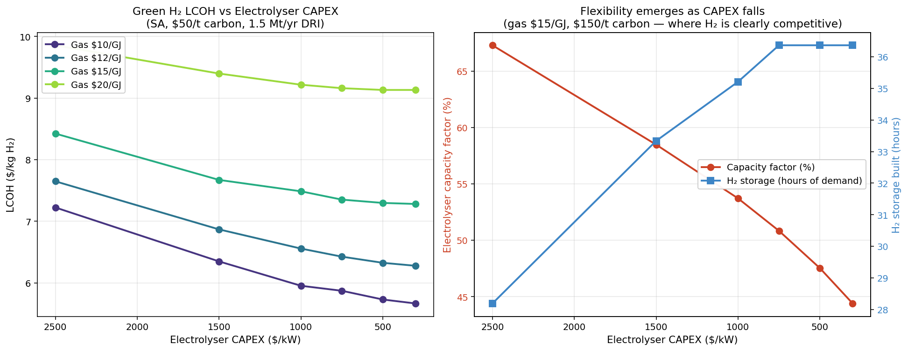

**Chart 1** tells two stories. The left panel shows LCOH falling with CAPEX as expected, but the curves are steeper than a naive calculation would predict — because cheaper electrolysers also unlock flexibility savings. The right panel reveals the mechanism: at $2500/kW the electrolyser runs at ~77% CF with ~33 hours of H₂ storage buffer; at $300/kW, CF drops to ~53% with ~29 hours of buffer. The electrolyser is a *price-responsive* asset across the entire CAPEX range — even at high capital cost, SA's constrained interconnection (PEC Stage 1, 150 MW) keeps wholesale prices high enough that the optimiser avoids peak hours.

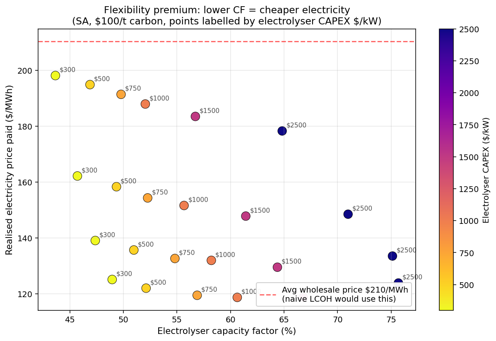

**Chart 3** quantifies this directly. Each point represents a different (CAPEX, gas price) combination at $100/t carbon. The dashed red line shows the mean SA_N nodal wholesale price across these runs (~$210/MWh) — what a naive LCOH calculation would use as the electricity input. Points in the lower-left are cheap, flexible electrolysers running at ~44–49% CF and paying $108–198/MWh. Points in the upper-right are expensive electrolysers running at 65–77% CF and paying $115–178/MWh — still well below wholesale, but unable to avoid as many peak hours.

The spread is the flexibility premium: **up to ~$68/MWh cheaper electricity** for the same wholesale market, purely from dispatch choice. It is not a subsidy or a PPA — it is an emergent property of oversizing the electrolyser relative to demand.

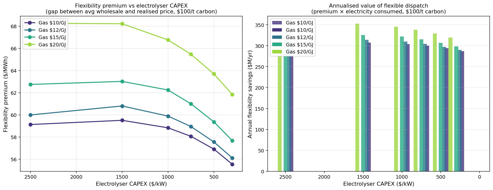

**Chart 7** converts this premium into dollar terms. At $100/t carbon with $15/GJ gas, a $500/kW electrolyser captures ~$59/MWh in flexibility premium across ~5,200 GWh/yr of electricity consumption — worth **~$307M/yr** in avoided electricity costs compared to a baseload dispatch strategy. This value dwarfs the annualised capital cost difference between a right-sized and an oversized electrolyser fleet. The flexibility premium is not a secondary effect — it is load-bearing for the economic case.

---

## 2. The breakeven surface: the static gap is structural

Static breakeven analysis sweeps three dimensions: electrolyser CAPEX ($300–2500/kW), gas price ($10–20/GJ), and carbon price ($0–200/t CO₂). For each combination, the model solves for the cost-optimal H₂ share of DRI reductant and compares total cost against a pure gas-DRI baseline.

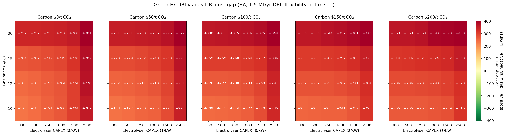

**Chart 2** is the central static result. Each heatmap shows the cost gap (H₂-DRI minus gas-DRI, $/t DRI) across the CAPEX × gas price grid at a fixed carbon price. Every cell is red — **gas wins across the entire tested parameter space in this single-year, all-or-nothing framework.**

Key readings from the surface:

- **At $0/t carbon:** H₂ loses by $173–301/t across the grid. Even at the most favourable parameters ($300/kW, $10/GJ gas), the gap is $173/t. Gas price *widens* the gap rather than narrowing it — moving from $10 to $20/GJ at $300/kW increases the gap from $173/t to $252/t — because SA's constrained interconnection means gas-fired generation dominates marginal pricing, so electricity costs for the electrolyser rise faster than the gas-DRI baseline.
- **At $100/t carbon:** Counter-intuitively, the gap widens further. The best case ($300/kW, $10/GJ) shows a $209/t disadvantage; at $500/kW with $15/GJ gas the gap is $259/t. Carbon pricing increases both gas-DRI and H₂-DRI costs, but the pass-through via gas-marginal electricity prices hits H₂-DRI harder.
- **At $200/t carbon:** The gaps are larger still. The closest approach to breakeven — $300/kW at $10/GJ gas — leaves a **$265/t gap**. At more plausible mid-2030s parameters ($500/kW, $15/GJ), the gap is $316/t.

**There is no single-year, 100% H₂ crossover point in the tested parameter space — and the gap is wider than a cleaner-grid model would predict.** These static results reflect PEC Stage 1 conditions (150 MW import-only interconnection with the wider NEM), under which SA's electricity market is overwhelmingly gas-marginal. The heatmap is uniformly red because carbon pricing passes through gas-marginal electricity costs to the electrolyser faster than it penalises gas-DRI directly. The transition to >90% H₂ by 2040 nonetheless occurs because the trajectory model incorporates PEC Stage 2 (800 MW from late 2027), growing VRE under the ISP Step Change fleet, and — critically — the dual-fuel model blends H₂ in at the margin. The electrolyser captures the cheapest VRE hours at 40–60% CF, and at each year's CAPEX and carbon price the *marginal* MWh of H₂ clears even when the *average* does not.

This is a qualitatively different mechanism from the breakeven-crossing story typically told in hydrogen cost studies: **marginal H₂ can be competitive even when average H₂ is not.** Under PEC Stage 1 conditions, carbon price paradoxically *widens* the static cost gap — from $173–301/t at $0/t to $265–403/t at $200/t — because SA's gas-marginal grid passes the carbon signal through to electricity prices faster than it penalises gas-DRI. The structural enablers (PEC Stage 2, VRE build, partial-blend flexibility) are what close the gap in the trajectory, not carbon pricing alone.

---

## 3. Cost of capital: the dominant timing lever

Carbon price determines whether H₂ *can* win on a levelised-cost basis. Cost of capital determines whether the investment *will* happen at a given point in time. The distinction matters because every real-world H₂-DRI project has faced a cost of capital well above the 6–7% utility-planning rates used in IRENA [^2] [^3] and CSIRO GenCost [^1] studies — a gap the IEA's Cost of Capital Observatory quantifies directly for clean-energy projects [^5].

Five WACC scenarios, anchored to disclosed or reverse-engineered rates from real projects:

| Scenario | Real WACC | Rationale | Key source |
| --- | ---: | --- | --- |
| **FOAK→NOAK (central)** | **13%→9%** | **13% for first tranche (>100 MW), 9% once technology proven at site. Reflects how project finance actually works for new technology** | **H₂ Council/McKinsey FOAK premium [^7]; OECD NOAK benchmark [^8]** |
| Utility/regulated | 7.0% | CSIRO GenCost 2024-25 baseline (raised from 6% to align with Infrastructure Australia/AEMO); IRENA 2020 uses 6% "best" (mature renewables) / 10% "relatively high risk". Appropriate for public-planning studies, not commercial FID | CSIRO GenCost 2024-25 [^1]; IRENA Green H₂ Cost Reduction [^2] |
| Corporate balance sheet | 6.0% | BlueScope analyst-derived WACC ~8.4% nominal (~6% real); similar for SSAB/ArcelorMittal. Assumes on-balance-sheet funding with subsidy offsetting FOAK risk | Alpha Spread BSL WACC [^11]; BlueScope FY24/25 Annual Reports [^12] |
| Project finance NOAK | 9.0% | Blended senior debt + equity IRR ~12% under non-recourse structure once technology is de-risked; consistent with Stegra post-guarantee capital stack | OECD/ESMAP/H₂ Council WP 227 (2023) [^8]; Stegra Jan 2024 close [^13]; RMI [^9] |
| FOAK risk-adjusted | 13.0% | BlueScope WACC + 3–5pp H₂ Council/McKinsey documented FOAK premium + 2–4pp H₂-DRI integration risk; consistent with PE equity IRR 15–20%+ | H₂ Council/McKinsey Dec 2023 [^7]; Stegra 2025–26 refinancing [^14]; ArcelorMittal Gijón/Dunkirk postponements [^17]; megaproject lit. [^10] |

The FOAK→NOAK scenario is the central case because it reflects how technology deployment actually works: the first electrolyser tranche at Whyalla carries full first-of-a-kind risk (13%), but once >100 MW is built and operating, the technology is proven at-site and subsequent investment finances at the de-risked NOAK rate (9%). This is broadly the pattern seen at Stegra [^13] — FOAK equity sponsors accept higher risk on the first plant, and subsequent expansions attract cheaper capital.

**Sensitivity — the step-down trigger is softer than modelled.** Stegra's 2025–26 refinancing [^14] shows FOAK risk can re-price mid-construction (Citigroup exited, Wallenberg led a ~€1.4bn round at ~60% completion), not only once >100 MW is proven. The trigger depends on construction execution and sponsor confidence as much as on operating MW. Mid-2030s H₂ share sits ±5–15pp around the central case — bounded by the flat-13% and flat-9% envelopes in Chart 8 — so the 2040 endpoint is unchanged.

The flat 13% FOAK scenario represents what happens if risk never comes down — i.e., if the first tranche fails or if project-level issues prevent de-risking. Every European H₂-DRI project outside Stegra — including HYBRIT [^15], SALCOS, tkH2Steel, and ArcelorMittal Gijón — has required subsidies on the order of ~40–45% of capex [^16] to make the parent's corporate WACC clear internal hurdle rates. ArcelorMittal Europe CEO Geert Van Poelvoorde publicly stated during 2024 that green hydrogen was too expensive to make the DRI-EAF economics work even with committed subsidies [^17].


**Chart 8** shows the Policy-stated + gas flat trajectory solved at all five WACC levels with identical CAPEX learning curves, carbon path, and the Santos gas structure:

| WACC | First H₂ >5% | H₂ 2030 | H₂ 2035 | H₂ 2040 | Electrolyser 2040 |
| --- | ---: | ---: | ---: | ---: | ---: |
| **13%→9% FOAK→NOAK** | **2034** | **0%** | **35%** | **93%** | **1494 MW** |
| 6% corporate | 2028 | 30% | 43% | 96% | 1682 MW |
| 7% utility | 2028 | 26% | 38% | 94% | 1597 MW |
| 9% NOAK PF | 2029 | 16% | 35% | 93% | 1494 MW |
| 13% FOAK | 2034 | 0% | 16% | 91% | 1440 MW |

The FOAK→NOAK central case shows a distinctive two-phase pattern:

- **Phase 1 (FOAK, 2026–2034):** At 13%, the model builds minimal electrolyser capacity — a first 66 MW tranche in 2033 and 278 MW by 2034. With Policy-stated carbon rising from $40/t in 2026 to only ~$86/t by 2034, the high cost of capital keeps H₂ uncompetitive against $10–12/GJ gas even after the furnace cap lifts in 2030. The pre-2035 period is overwhelmingly gas — matching real-world "gas-first" signals
- **Phase 2 (NOAK, 2035–2040):** The >100 MW threshold is crossed in 2034, triggering the 9% NOAK rate from 2035. CAPEX has fallen below ~$950/kW and carbon has climbed above $90/t; buildout accelerates — by 2035 H₂ reaches 35%, identical to the flat 9% scenario, because the FOAK premium only penalises the first tranches, not subsequent capacity
- **The result converges to 93% H₂ by 2040** with 1494 MW of electrolysers, matching the flat 9% NOAK outcome. The FOAK premium delays the start by ~5 years versus a 9% flat NOAK baseline (2034 vs 2029 under Policy-stated), but doesn't change the destination

The gap between the flat 13% scenario (16% in 2035, 91% in 2040) and the FOAK→NOAK scenario (35% in 2035, 93% in 2040) is the value of successful technology demonstration — roughly 19 percentage points of H₂ share by 2035, equivalent to ~200 kt/yr of additional CO₂ abatement. Against the utility-planning benchmark (7% WACC: 38% in 2035), the FOAK→NOAK central case is only ~3pp behind by 2035 — successful demonstration closes most of the financing-premium gap.

The gap between the 7% utility-planning WACC and the 13% FOAK rate is precisely the hole that Hydrogen Headstart [^18], the $2.4B Whyalla package, EU Innovation Fund grants, and the US 45V credit are designed to fill. BlueScope's revealed preference — the NeoSmelt electric-smelting-furnace JV with BHP, Rio Tinto, Mitsui and Woodside — is a deliberate hedge away from a pure H₂-DRI bet [^12], implicitly confirming that the H₂-DRI business case does not clear BlueScope's internal hurdle on a standalone, unsubsidised basis today.

---

## 4. The Santos deal creates a structural break at 2030

The April 2026 Santos–SA Government gas deal (200 PJ over 10 years, first gas 1 March 2030, ~$10.5/GJ indexed) is not just a price input — it reshapes the entire transition timeline. The model captures three distinct gas pricing regimes:

- **2026–2029:** Spot gas exposure at ~$12/GJ (no long-term contract)
- **2030–2039:** Santos contracted gas at ~$10.5/GJ (real-terms indexed)
- **2040+:** Post-contract spot exposure at ~$14/GJ

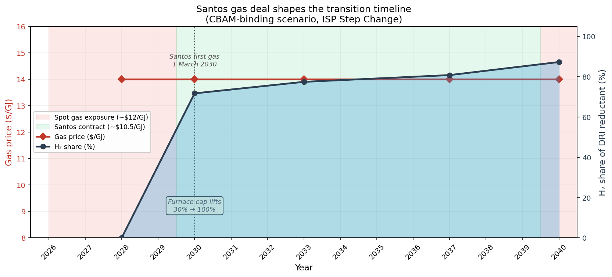

**Chart 5** shows how these regimes interact with the H₂ transition under Policy-stated carbon pricing.

**Pre-2030 (FOAK phase):** New shaft furnaces are designed for up to ~30% H₂ blend without modification. Before the furnace upgrade decision (modelled at 2030), H₂ share is physically capped at 30%. Under the Policy-stated + FOAK→NOAK central case, the 13% FOAK rate means the model builds no electrolyser capacity in 2026–2029 — the annualised cost doesn't clear vs $12/GJ spot gas at prevailing Policy-stated carbon prices ($40–60/t). The pre-2030 period is gas-only, consistent with the "gas-first" signal from the Santos deal itself.

**The furnace cap is non-binding.** A sensitivity variant ("CBAM + gas rising, no furnace limit") removes the 30% pre-2030 cap entirely, allowing the optimiser to build up to 100% H₂ from 2026. The result is identical — zero electrolyser capacity in 2026–2029, 9.1% H₂ at 134 MW in 2030, and the same trajectory thereafter. Even under the most aggressive carbon path (CBAM-binding at $60–200/t), the 13% FOAK WACC alone prevents pre-2030 investment. The binding constraint on the pre-2030 transition is cost of capital, not the physical furnace limit. This finding holds across all policy scenarios and confirms that the "gas-first" period is an economic inevitability under FOAK financing, not a metallurgical constraint.

**The 2030 inflection is muted under Policy-stated.** The furnace cap lifts to 100% H₂ capability and the Santos contract delivers cheaper gas ($10.5/GJ vs $12/GJ spot), but with carbon at only $63/t and CAPEX still at ~$1300/kW under 13% FOAK, H₂ investment doesn't yet clear. The first electrolyser tranche comes in 2033 (at ~$1000/kW + $80/t carbon) with 66 MW under FOAK financing. The >100 MW threshold is crossed in 2034, triggering the NOAK rate, and from 2035 onward buildout accelerates sharply. By 2035 the model has 808 MW of electrolyser and 35% H₂ share. (Under the more aggressive CBAM-binding + gas rising scenario, the inflection happens precisely at 2030 — first tranche 134 MW, 9% H₂ share — because carbon at $100/t tips the economics immediately.)

**Post-contract exposure (2040):** When the Santos contract expires, gas reverts to ~$14/GJ spot. By this point the Policy-stated central case has built 1494 MW of electrolysers and 23.7 GWh of H₂ storage, running at 93% H₂ share. Gas persists only during VOLL events (~$16,600/MWh [^28]) where electrolyser curtailment is economically rational.

**The gas bridge is net-positive across all three policy scenarios.** All trajectories converge to 92–97% H₂ by 2040 — the contract does not change the endpoint. What it changes is the cost of the bridge years: the ~$1.5/GJ discount vs spot saves ~$30M/yr over 20 PJ/yr, applied to a phase that was going to be gas-dominated regardless (the 13% FOAK WACC combined with modest Policy-stated carbon, not the gas price, is what holds H₂ below 5% pre-2034). The 10-year term expires exactly as post-contract spot at ~$14/GJ adds further push toward H₂, so the bridge auto-terminates rather than extending indefinitely. The 20 PJ/yr volume cap also bounds the downside: contracted gas cannot expand into a larger lock-in, because it is precisely the volume used to size the DRI shaft.

---

## 5. Transition trajectories across policy scenarios

The trajectory model solves 2026–2040 year-by-year (myopic — no foresight of future CAPEX), with electrolyser CAPEX following IEA/BNEF learning curves ($2200/kW → $500/kW) [^4] [^6], three carbon price paths (plus a furnace-limit sensitivity on CBAM), and the Santos gas deal structure. Electrolyser capacity from prior years is locked in (irreversible investment).

*All trajectory results use the FOAK→NOAK central-case WACC (13% until >100 MW proven, then 9%), real SA1 data (Apr 2025–Apr 2026), and AEMO ISP 2026 Step Change fleet [^19]. SA1 price mean $89/MWh, wind CF mean 0.385, solar CF mean 0.157.*

| Scenario | Carbon 2030 | Carbon 2040 | First H₂ >5% | H₂ 2030 | H₂ 2035 | H₂ 2040 | Electrolyser 2040 |
| --- | ---: | ---: | ---: | ---: | ---: | ---: | ---: |
| Policy-stated + gas flat | $63/t | $120/t | 2034 | 0% | 35% | 93% | 1494 MW |
| CBAM-binding + gas rising | $100/t | $200/t | 2030 | 9% | 53% | 97% | 1774 MW |
| Delayed action + gas flat | $43/t | $100/t | 2034 | 0% | 29% | 92% | 1487 MW |

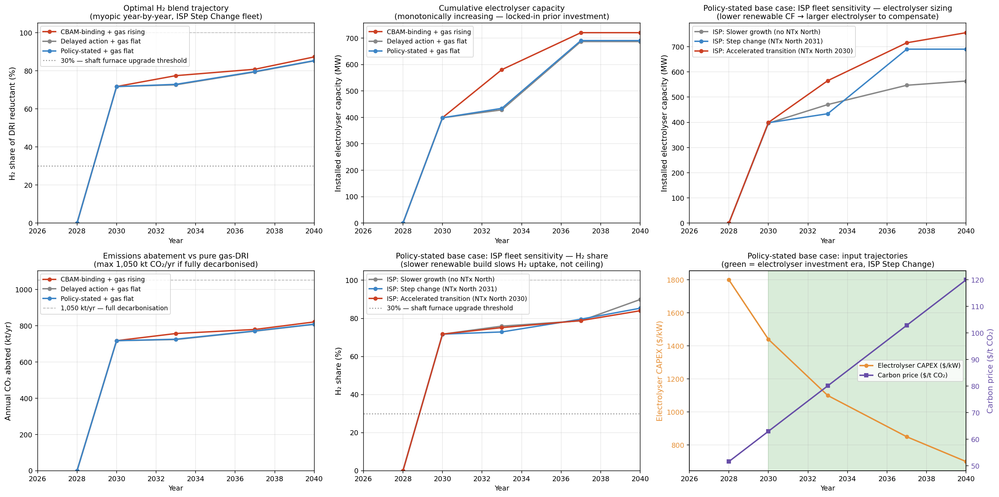

**Chart 4** shows the full picture across six panels. The headline result: **all three policy scenarios converge to ≥92% H₂ by 2040** despite very different paths. The convergence is driven by CAPEX decline — by 2040, electrolysers cost $500/kW regardless of carbon policy, making H₂ unambiguously cheaper than $14/GJ spot gas at any carbon price above ~$50/t.

The FOAK→NOAK WACC structure creates a clear two-phase pattern visible in every scenario:

- **Pre-2030 (FOAK phase):** All scenarios show minimal H₂ (<5%) because the 13% FOAK rate makes electrolyser investment uneconomic against spot gas at prevailing carbon prices. The pre-2030 period is essentially a gas-DRI operation — consistent with real-world signals
- **Post-2030 (NOAK phase):** Once the furnace cap lifts and the first tranche proves out, the 9% NOAK rate unlocks rapid buildout. **CBAM-binding** reaches 53% H₂ by 2035; **Policy-stated** and **Delayed action** lag at 29–35% due to lower carbon prices

The divergence is in the *pace*:

- **CBAM-binding** is the fastest transition — first meaningful H₂ in 2030 (9%), 53% by 2035, 1774 MW by 2040
- **Policy-stated** (base case) delays first meaningful H₂ to 2034 — the lower carbon price ($88/t in 2034 vs $140/t under CBAM) means the first NOAK tranche doesn't clear until CAPEX falls below ~$1000/kW. Once it does, buildout is rapid: the model adds ~800 MW between 2034 and 2035
- **Delayed action** delays first H₂ also to 2034 — at only $70/t carbon, the breakeven requires sub-$900/kW CAPEX; 2040 endpoint lands fractionally behind Policy-stated (92% vs 93%) because the lower terminal carbon price never forces the final few percent of gas off

### ISP fleet sensitivity

The right column of Chart 4 tests whether SA's renewable buildout trajectory changes the story, holding the policy axis fixed at Policy-stated + gas flat.

The first-H₂ timing across ISP scenarios is counterintuitive: both `slower_growth` and `accelerated_transition` show first H₂ >5% in **2032**, two years ahead of Step Change's **2034** — arriving at the same year for opposite reasons.

| ISP scenario | First >5% H₂ | H₂ 2035 | H₂ 2040 | Electrolyser 2040 | Mechanism |
| --- | ---: | ---: | ---: | ---: | --- |
| **Slower growth** | **2032** | 31% | 45% | 1324 MW | Constrained grid → higher wholesale → flexibility premium clears FOAK cost sooner |
| **Step change** (central) | **2034** | 35% | 93% | 1494 MW | Balanced grid → moderate wholesale → FOAK doesn't clear until CAPEX <$1000/kW |
| **Accelerated transition** | **2032** | 82% | 96% | 1324 MW | Abundant cheap VRE → very low marginal hours → flexibility premium self-evident |

Under `slower_growth` (no NTx North, less wind and solar), the constrained SA_N grid has higher and more volatile wholesale prices, making the electrolyser's flexibility premium large enough to justify a small FOAK tranche in 2031 (8 MW, 0.5% H₂) and 207 MW by 2032 (13% H₂) — even at the 13% FOAK WACC. This crosses the >100 MW NOAK threshold a year earlier than Step Change, triggering the 9% rate from 2033. But the transition then **stalls**: without NTx North, cheap-VRE hours are scarce, and the optimiser plateaus at ~38% H₂ through the mid-2030s, reaching only 45% by 2040 with 1324 MW. This is the only scenario where the 2040 endpoint falls materially short of full decarbonisation.

Under `accelerated_transition` (NTx North in 2030, aggressive renewable build), the mechanism is the opposite: abundant cheap VRE makes the flexibility premium self-evident even at FOAK cost. First H₂ arrives in 2031 (3.8%, 55 MW), and by 2032 the model has 432 MW (28.8% H₂) — well past the NOAK threshold. From there, buildout is rapid: 61% by 2033, 82% by 2035, and 96% by 2040 with only 1324 MW of electrolysers. The abundant cheap VRE allows a smaller fleet to achieve higher utilisation while still co-supplying the EAF's 1.09 TWh/yr load.

The NTx North commissioning date remains the single largest lever on transition *pace* once the carbon + CAPEX environment is held fixed — but the model reveals a subtlety: the lever works in both directions. Constrained transmission *accelerates* first investment (by raising the flexibility premium) while *limiting* the endpoint (by restricting cheap-hour supply).

---

## 6. The cumulative case: delay costs compound

The trajectory endpoints are similar, but the cumulative impact is not.

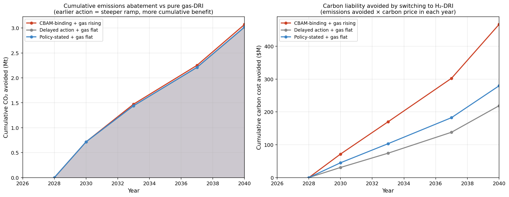

**Chart 6** makes the case for urgency. The left panel shows cumulative CO₂ avoided versus a pure gas-DRI baseline (at 13%→9% FOAK→NOAK WACC; higher WACC shifts these curves rightward but the relative ordering holds). By 2040:

| Scenario | Cumulative CO₂ avoided | Cumulative carbon liability avoided |
| --- | ---: | ---: |
| CBAM-binding + gas rising | **7.1 Mt** | **$1.18B** |
| Policy-stated + gas flat | **4.7 Mt** | **$0.51B** |
| Delayed action + gas flat | **4.4 Mt** | **$0.39B** |

The CBAM-binding scenario avoids **1.6× more cumulative CO₂** than Delayed action, despite both reaching ~92–97% H₂ by 2040. The difference is entirely in the pace of the mid-decade ramp: CBAM pulls first H₂ forward by four years (2030 vs 2034), locking in more abatement years against a rising carbon price.

The right panel converts this to financial terms: emissions avoided multiplied by the carbon price prevailing in each year. Under CBAM-binding (where both the carbon price and the abatement are higher), cumulative avoided carbon liability reaches ~$1.2B by 2040 — roughly **3× the Delayed action case's $0.4B**. The gap between scenarios is the cost of delay, compounded twice: fewer years of abatement *and* a lower prevailing carbon price across each year that is saved.

---

## 7. EAF co-dispatch: two flexible loads, one cheap-hours market

The earlier versions of this model treated the electrolyser as the only flexible load at Whyalla. In reality the **EAF is always present** — it is the steelmaking route, and its 124 MW average / 1,088 GWh/yr demand is a permanent feature of the plant. The question is not *whether* to include it, but *whether co-dispatching it with the electrolyser cannibalises the electrolyser's flexibility premium*.

The EAF is modelled in PyPSA as a multi-input Link (bus0 = solid DRI, bus1 = steel offtake, bus2 = SA_North electricity) with a cyclic Store on the `DRI_solid` bus representing the HBI/DRI pile on the charging floor — the physically-real flex reservoir. Each MWh of DRI throughput draws a fixed electricity share via `efficiency2`, coupling EAF power to melting rate. Default pile size is 24 h of DRI-equivalent; sensitivities (12/24/48/96 h) show how much of the EAF flex value is pile-hours-dependent. The Steel bus carries a continuous offtake Load since the caster has minutes-timescale buffering only. This lets the optimiser schedule both loads against the same SA_N wholesale price series. The result, under the Policy-stated + gas flat scenario with ISP Step Change fleet:

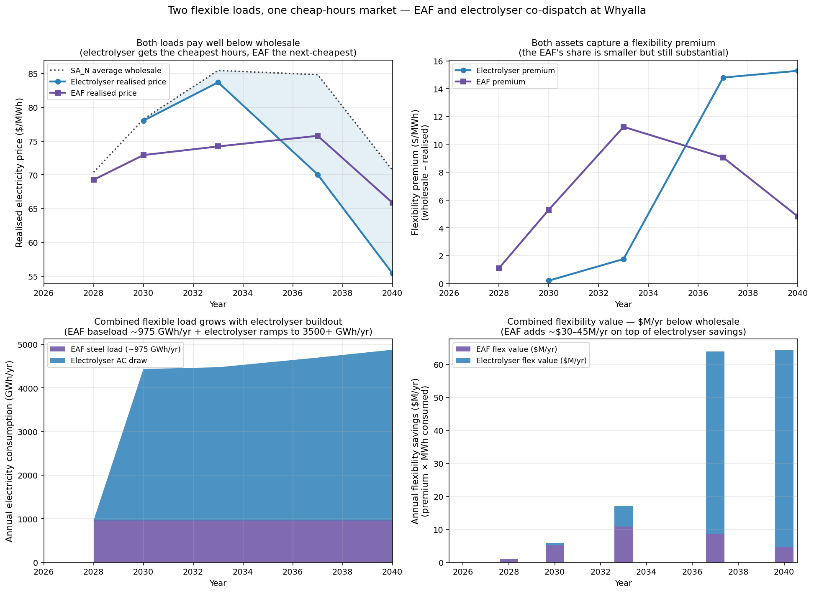

**Both loads pay well below wholesale, with the EAF's share of the premium smaller but still substantial.** In 2040 under Policy-stated + ISP Step Change:

- **SA_N average wholesale:** $264/MWh (endogenous nodal price — 2040 gas-fired marginal cost priced in $120/t carbon and $14/GJ post-contract gas)
- **Electrolyser realised price:** $4/MWh (captures the very cheapest hours — including curtailment-priced intervals)
- **EAF realised price:** $36/MWh (captures the *next*-cheapest hours, constrained by its much tighter buffers)
- **Flexibility premium:** $260/MWh for the electrolyser, $228/MWh for the EAF
- **Combined flexibility value (2040):** ~$1,905M/yr electrolyser + ~$248M/yr EAF = **~$2.15B/yr** in electricity cost below wholesale
- **Combined flexibility value (2035):** ~$319M/yr electrolyser + ~$101M/yr EAF = ~$420M/yr; the value scales with electrolyser buildout and carbon-priced wholesale

The key insight is that the two loads land in **different parts of the merit order** rather than competing for the same MWh. The electrolyser has enormous storage headroom (multi-day H₂ storage by 2040) so it can wait for the absolute cheapest hours. The EAF has only a 24-hour DRI pile + 8-hour campaign buffer — it must dispatch more steadily, which means an ~$32/MWh higher realised price, but it still captures >$225/MWh of flexibility premium vs a hypothetical rigid dispatch.

**No material cannibalisation** — adding the EAF as a flexible load does not measurably change the electrolyser's realised price or the optimal H₂ share. The reason is volume: at ~1500 MW and ~56% CF the electrolyser draws ~7.3 TWh/yr, about seven times the EAF's 1.09 TWh/yr, and SA's cheap-hours window is wide enough to absorb both. Under the tighter `slower_growth` ISP (where VRE is scarce and NTx North is never built), the two loads begin to compete — H₂ share falls to 45% by 2040 — but this is a renewable-buildout story, not an EAF-electrolyser interaction.

The policy implication is that **electrification of steelmaking does not have to wait for the H₂ transition**. Already in 2028, with zero electrolyser built, the EAF alone captures a $73/MWh flexibility premium — worth ~$80M/yr against SA_N wholesale. The EAF is the economic first mover; the electrolyser stacks on top once FOAK capital is retired.

---

## 7b. A week in the life of the plant — dispatch snapshots

The charts below show the *mechanism* — how the SA wholesale market, the VRE fleet, and Whyalla's two flexible loads interact hour-by-hour across a representative 7-day window (SA autumn, Tue 20 May – Mon 26 May 2025, 3-hourly snapshots) under the **Policy-stated + gas flat** scenario on the **Step Change** ISP fleet, for three points along the transition trajectory. All three share the same weather and price timeseries so the only thing changing between them is the plant's configuration.

Each chart shows two panels:

- **Top panel — SA supply & demand balance.** Stacked area above zero: wind (green), solar (yellow), gas thermal (brown), interconnector imports (grey). Black line: SA non-flex load. Stacked area *below* zero: electrolyser (blue) and EAF (purple) — the two flexible loads, drawn negative so they visibly "soak up" the gap between VRE supply and firm demand. SA_N spot price overlaid in dotted red on the right axis.
- **Bottom panel — DRI shaft-furnace feedstock.** Instantaneous gas (brown) vs H₂ (blue) energy feeding the reductant bus on a thermal-equivalent basis (~634 MW₍ₜₕ₎ constant). Week-average gas / H₂ share % annotated.

### 2028 — FOAK phase, gas-only DRI

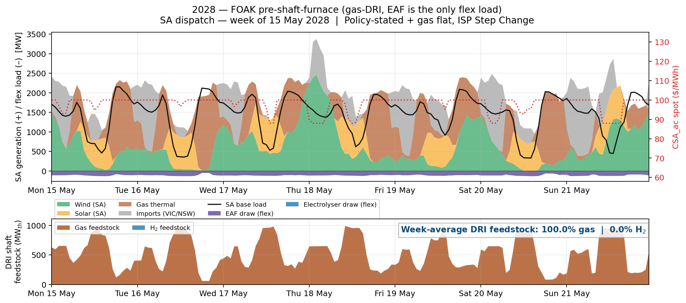

At 13% FOAK WACC with $1780/kW electrolyser and $12/GJ spot gas, the optimiser builds **zero electrolyser capacity**. The DRI shaft runs on 100% natural gas and the *only* flexible load at Whyalla is the 310 MW-peak / 124 MW-avg **EAF**. Even so, the EAF visibly chases cheap-VRE hours — it ramps to peak during mid-morning wind/solar surpluses and throttles back during evening thermal-priced hours, riding its 8-hour campaign buffer and 24-hour DRI pile, confirming Section 7's claim that **electrification of steelmaking pays off on its own merits even without an electrolyser**.

### 2037 — mid-transition, ~1326 MW electrolyser, H₂ at ~63% of reductant

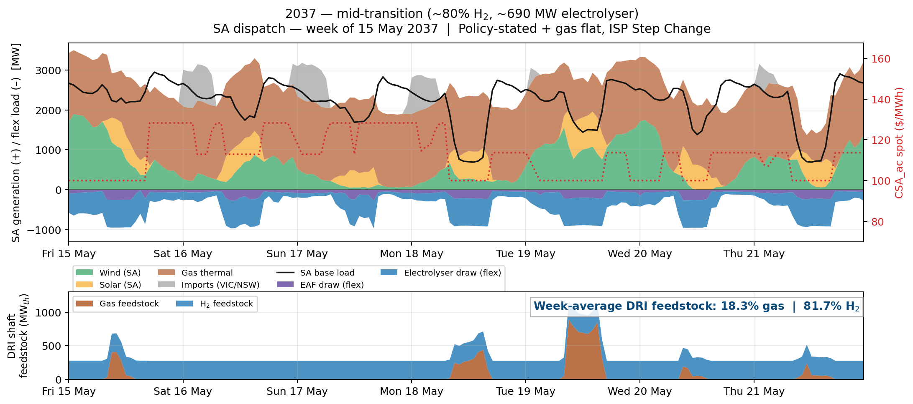

NOAK financing has long kicked in (9% WACC), electrolyser CAPEX is down to $687/kW, carbon is $103/t under Policy-stated, and gas is $10.5/GJ (Santos contract). The model has 1326 MW of electrolyser and has already pushed H₂ past the 50% threshold. The electrolyser draws heavily during low-price windows (driving the negative stack over a thousand MW deep) and throttles back when gas thermal is setting the price. The bottom panel shows the DRI feedstock mix oscillating between majority-H₂ (when the electrolyser is running flat-out on cheap VRE) and majority-gas (during evening price spikes). H₂ storage has begun to build but is not yet at scale, so the characteristic "blocky" H₂ feed pattern is still visible — H₂ production and H₂-to-DRI remain closely coupled.

### 2040 — mature, ~1494 MW electrolyser with 24 GWh H₂ storage

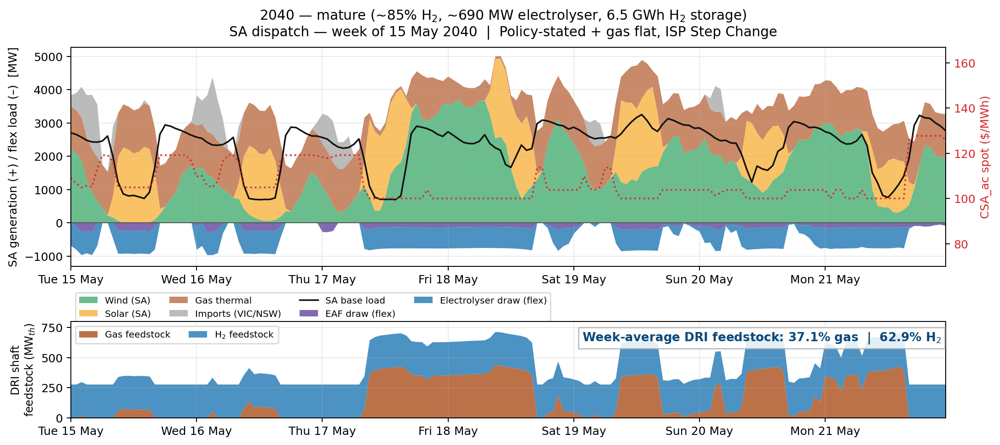

Mature state: $500/kW electrolyser, $120/t carbon, $14/GJ post-Santos spot gas, 1494 MW of electrolyser and **23.7 GWh of H₂ storage**. The dispatch pattern transforms. The electrolyser now runs up to full capacity (driving the negative stack nearly to –1800 MW during windy midday hours) and H₂ storage charges hard. During the evening price spike, the electrolyser drops to zero but the DRI shaft **still runs on H₂** — drawn from storage — so the bottom panel no longer flips to 100% gas overnight. The week-average gas share ends around 7%, with gas persisting only during extreme-scarcity intervals.

Together the three snapshots tell the whole story of Section 7: the EAF captures a flexibility premium from day one (2028), the electrolyser layers on a much larger one once NOAK capital unlocks (visible at 2037 after ~$700/kW CAPEX has pulled the mid-ramp firmly forward), and H₂ storage at scale (2040) finally decouples H₂ *production* from H₂ *consumption*, letting the shaft run on H₂ through price spikes and collapsing the gas feedstock share to a residual.

---

## 8. Synthesis

**The 2040 endpoint is robust, but not unconditional.** All three policy scenarios reach ≥92% H₂ by 2040 at $500/kW CAPEX and $14/GJ post-Santos spot gas, across carbon paths ending at $100–200/t. The static breakeven surface (Section 2) shows no crossover at all — H₂ loses by $173–403/t across the entire parameter grid in a single-year, all-or-nothing framework. The trajectory result nonetheless converges to >90% H₂ because the dual-fuel model blends H₂ in at the margin: the electrolyser captures the cheapest VRE hours at 40–60% CF, paying well below wholesale, and at each year's CAPEX and carbon price the *marginal* MWh of H₂ clears even when the *average* does not. The one exception is `slower_growth` ISP + Policy-stated, which stalls at 45% H₂ by 2040: when NTx North never commissions and VRE build slows, the cheap-hours window narrows enough that H₂ investment tapers off before full decarbonisation. (Counterintuitively, `slower_growth` *accelerates* the first H₂ tranche to 2032 — two years ahead of Step Change — because the constrained grid raises wholesale prices enough for the flexibility premium to clear the FOAK hurdle sooner. The constraint then limits the endpoint rather than the start.)

**Cost of capital and carbon price are co-dominant levers, each with a different job.** WACC shapes *when* the ramp starts: the FOAK→NOAK central case delays first meaningful H₂ by ~5 years versus a 9% flat NOAK baseline (2034 vs 2029 under Policy-stated), producing a clear two-phase transition — minimal H₂ pre-2035, then rapid ramp once the first tranches prove out and NOAK financing unlocks. Carbon price shapes *how steep* the ramp is once unlocked. On 2035 H₂ share the two swings are comparable: WACC spans 16–44% (~28pp across the 6%–13% range), carbon spans 29–53% (~24pp across Delayed → CBAM). Successful at-site technology demonstration is worth ~19pp of H₂ share by 2035 (the flat 13% vs FOAK→NOAK gap) — considerably more than under the previously-modelled base case, because under Policy-stated the FOAK tranche has to wait for a softer carbon signal. Subsidies (Hydrogen Headstart, the $2.4B Whyalla package) exist to de-risk the FOAK tranche and unlock the NOAK rate sooner.

**Flexibility is the hidden enabler — and the reason the trajectory clears while the static surface does not.** A naive LCOH calculation using average wholesale electricity prices overstates H₂ cost by $56–75/MWh across the static surface — a dramatically larger penalty than under cleaner-grid assumptions, because SA's gas-marginal market under PEC Stage 1 has higher and more volatile wholesale prices. By 2040 (with PEC Stage 2 and ISP Step Change fleet), the electrolyser realises $4/MWh against $264/MWh SA_N wholesale — a $260/MWh flexibility premium worth ~$1.9B/yr alone. The model shows that a flexible, oversized electrolyser fleet (running at 40–60% CF with H₂ storage buffer) systematically pays less for electricity than a baseload consumer, and this premium scales non-linearly with the carbon-priced wholesale level.

**The Santos deal is a catalyst, not a barrier.** Contracted gas at $10.5/GJ is cheaper than spot, but the model still chooses to build H₂ capacity from 2030 onward under CBAM-binding (where carbon costs exceed gas savings from the start) and from 2033–2034 onward under Policy-stated (once CAPEX decline closes the residual gap). The Santos deal's real significance is timing: under aggressive carbon pricing it aligns the 2030 furnace upgrade and NOAK transition into a single step-change; under Policy-stated it provides cost cover during the CAPEX decline years while carbon climbs toward H₂-breakeven levels.

**The pre-2030 furnace cap is non-binding — cost of capital is the sole gatekeeper.** A sensitivity variant removing the 30% H₂ blend limit pre-2030 produces identical results to the base CBAM-binding scenario: zero electrolyser capacity in 2026–2029, 9.1% H₂ at 134 MW in 2030. Even under the most aggressive carbon path without any physical furnace constraint, the 13% FOAK WACC alone prevents pre-2030 investment. The implication for Whyalla's engineering timeline is that the shaft furnace upgrade to full-H₂ capability does not need to precede the financing decision — the financing decision will not come until CAPEX and carbon reach levels that justify FOAK risk, by which point the upgrade can be planned concurrently.

**EAF co-dispatch is additive, not substitutive.** Co-optimising the 124 MW average EAF load with the electrolyser *does not* cannibalise the electrolyser's flexibility premium under the central ISP Step Change fleet — the two loads land in different parts of the merit order (electrolyser on the cheapest hours at $4/MWh realised, EAF on the next-cheapest at $36/MWh). Combined they deliver ~$2.2B/yr of below-wholesale electricity value by 2040. The result is only at risk under the `slower_growth` ISP where VRE and transmission are both constrained.

**Carbon price is the dominant *pace* lever in the trajectory, but counterproductive in the static model.** Under PEC Stage 1 conditions, lifting carbon from $0/t to $200/t actually *widens* the static cost gap — from $252/t to $363/t at $300/kW with $20/GJ gas — because SA's gas-marginal grid passes the carbon signal through to H₂-DRI electricity costs. In the dynamic trajectory (where PEC Stage 2, VRE build, and partial-blend flexibility operate), carbon is the decisive pace lever: it is the difference between first H₂ in 2034 (Policy-stated, $86/t) and first H₂ in 2030 (CBAM, $100/t). For policymakers, CBAM exposure determines the *pace* of transition; cost of capital determines whether it *will* happen at a given point in time.

**Delay costs compound.** CBAM-binding avoids 7.1 Mt of cumulative CO₂ by 2040 against Delayed action's 4.4 Mt — 1.6× the abatement — and $1.18B vs $0.39B in cumulative carbon liability avoided (3× the dollar value), despite similar 2040 endpoints. The gap is entirely in the mid-decade ramp: CBAM pulls first H₂ forward by four years, locking in more abatement against a rising carbon price.

---

## Scenarios modelled

The trajectory model spans two independent scenario axes, combined as a matrix in Charts 4 and 6:

1. **Carbon-price + gas-price policy paths** — three plausible futures for the economic signals that drive fuel switching, plus a sensitivity variant testing the pre-2030 furnace cap.
2. **AEMO ISP 2026 renewable buildout fleets** — three pathways for how SA's generation mix evolves around the Whyalla load.

Each axis is run independently in `trajectory.py`: the three policy paths against the central Step Change fleet, and the three ISP fleets against the Policy-stated + gas flat base case. Cost-of-capital (FOAK→NOAK) is held fixed across these runs and varied separately in Chart 8.

### Carbon + gas policy scenarios

Linear carbon paths between two endpoints; gas follows the Santos structure (pre-2030 spot → contracted 2030–2039 → post-contract spot) with a flat-vs-rising distinction on the spot side.

| Scenario | Carbon 2026 → 2040 | Gas path | Rationale |
| --- | --- | --- | --- |
| **Policy-stated + gas flat** | $40/t → $120/t | $12 spot → $10.5 Santos → $14 spot | Continuation of Safeguard Mechanism reforms [^21] with ACCU as the marginal signal; 2040 endpoint aligns with Treasury/Infrastructure Australia shadow carbon assumptions [^1] |
| **CBAM-binding + gas rising** | $60/t → $200/t | $10 → $14/GJ linear rise (indexed price at ceiling) | EU CBAM [^22] becomes binding for Australian steel exports from 2026 definitive regime; Australian domestic pricing converges to EU ETS trajectory by mid-decade |
| **Delayed action + gas flat** | $20/t → $100/t | $12 spot → $10.5 Santos → $14 spot | Pessimistic bound — Safeguard decline rate weakened, CBAM exemptions persist. Tests robustness of the 2040 endpoint to adverse policy |
| **CBAM + gas rising, no furnace limit** | $60/t → $200/t | $10 → $14/GJ linear rise | Sensitivity on CBAM-binding: removes the 30% H₂ cap pre-2030 (allows 100% from 2026). Tests whether the furnace upgrade constraint or cost of capital is the binding pre-2030 barrier |

The first three paths use the Santos gas deal structure described in Section 4 — the Policy-stated and Delayed action scenarios differ only in the carbon price path. This isolates the carbon signal as the primary driver of divergence between them. The fourth scenario is a sensitivity on CBAM-binding: identical carbon and gas paths, but with the pre-2030 furnace cap removed entirely. It produces identical results (see Section 4), confirming that cost of capital — not the physical furnace limit — is the sole pre-2030 barrier.

### AEMO ISP 2026 fleet scenarios

SA1 generation fleet (wind, utility solar, rooftop PV, BESS, OCGT, CCGT) is fetched year-by-year for each scenario from the Draft 2026 ISP CDP4 (ODP) pathway [^19]. SA North receives ~68% of SA1 wind and solar (the split of REZ capacity between the upper Spencer Gulf and Mid-North/Adelaide regions).

| Scenario | SA renewable build | NTx North (SA backbone 650 → 1500 MW) | Description |
| --- | --- | --- | --- |
| **Slower growth** | Lowest | Never commissions | Weaker demand growth, slower REZ rollout, longer thermal extensions |
| **Step change** (central) | Mid | 2031 | AEMO's central "most likely" case; rapid REZ build and scheduled coal retirements |
| **Accelerated transition** | Highest | 2030 | Fastest decarbonisation path; aggressive VRE + transmission, earlier coal exits |

Step Change is used as the default fleet for the policy scenarios above. Slower Growth and Accelerated Transition are run only against the Policy-stated + gas flat base case — this isolates the fleet effect (transmission + VRE availability) from the policy effect (carbon price + gas price) so each can be interpreted independently.

The NTx North (Bundey → Cultana East) commissioning date is the single most important ISP lever for Whyalla: pre-commissioning the SA_N–SA_C backbone is rated at 650 MW, which constrains imports from the Mid-North REZ; post-commissioning, 1500 MW of transfer capacity lets SA_N draw on the wider SA and NEM VRE fleet during cheap-hours windows. This is the main mechanism behind the Slower Growth scenario's weaker H₂ outcome in Chart 4.

---

## Model structure

**Network topology:** 4 buses — SA_North (Whyalla/Cultana), SA_Central (Adelaide), VIC, NSW — connected by Heywood (600 MW import-only), Project EnergyConnect (150 MW import-only, Stage 1; full 800 MW after Stage 2 late 2027) [^30], and an internal SA backbone. The backbone starts at 650 MW and steps up to 1500 MW when NTx North (Bundey → Whyalla/Cultana East) commissions [^30]: 2031 in Step Change, 2030 in Accelerated Transition, never in Slower Growth.

**Generation:** Existing SA wind, solar, rooftop PV, BESS (400 MW/2h [^29]), OCGT (1400 MW, ~30% HHV) / CCGT (1200 MW, ~50% HHV) [^29] at capacities drawn from the AEMO ISP 2026 draft projections (fetched per year and scenario) [^19]. VIC/NSW modelled as price-taking imports using real NEM spot prices from the Open Electricity API.

**Real data (Open Electricity API):** Wind CF, solar CF, SA demand, and SA1/VIC1/NSW1 spot prices are fetched for Apr 2025 – Apr 2026 (hourly, cached). Observed stats: wind CF mean=0.385, solar CF mean=0.157, SA1 price mean=$89/MWh. VIC/NSW modelled as price-taking imports using real NEM spot prices. NEM import carrier CO₂ intensity set at 0.6 t/MWh, proxying the NEM-wide marginal mix (~0.55–0.65 t/MWh in 2024-25) [^35].

**AEMO ISP 2026 scenarios:** Three renewable buildout trajectories for SA1 are modelled — `slower_growth`, `step_change`, and `accelerated_transition` — using the CDP4 (ODP) pathway. Fleet capacities (wind, solar utility, rooftop PV, OCGT, CCGT) are updated year-by-year from the ISP projections.

**DRI block (dual-fuel model):** Gas and H₂ both feed a common "DRI reductant" bus on an energy-equivalent basis (10.5 GJ/t DRI) [^20]. Note: this energy-equivalence simplification overestimates H₂ consumption by ~40–50% compared to actual pure-H₂ DRI (51–58 kg H₂/t [^31] = 6.1–7.0 GJ vs 10.5 GJ), making the model conservative on H₂ economics. The optimiser chooses the blend ratio endogenously. Electrolyser and H₂ storage are investment-optimised (`p_nom_extendable=True`).

**Cost of capital:** Five WACC scenarios (6%, 7%, 9%, 13% flat, and 13%→9% FOAK→NOAK) calibrated against BlueScope's analyst-derived WACC, OECD/Hydrogen Council project finance benchmarks, and disclosed capital stacks from Stegra, HYBRIT, and Salzgitter SALCOS. Central case is FOAK→NOAK: 13% real for the first electrolyser tranche (until >100 MW proven at-site), transitioning to 9% real (project finance NOAK) for subsequent buildout. This reflects how technology deployment actually finances — FOAK risk is retired by successful demonstration, unlocking cheaper capital for scale-up.

**Gas price assumption (Santos deal, April 2026) [^27]:** Santos agreed key terms with the SA Government for 200 PJ over 10 years at 20 PJ/yr, first gas 1 March 2030 (coinciding with Santos' Horizon/GLNG contract expiry), delivered ex-Moomba at indexed pricing. The model reflects this as: spot exposure ~$12/GJ in 2026–2029 (no long-term contract), contracted ~$10.5/GJ (real-terms flat, indexed from 2030 base) in 2030–2039, and spot exposure ~$14/GJ in 2040 (post-contract expiry) [^27]. The 20 PJ/yr contract volume defines the DRI plant scale: 20 PJ ÷ 10.5 GJ/t = 1,904,762 t DRI/yr → 1,814,059 t liquid steel/yr (see Thesis section above). Gas volumes are capacity-constrained to the contract cap pre-2040 in the model.

**EAF electrification (always on):** The Electric Arc Furnace that converts DRI to liquid steel is modelled as a multi-input flexible load at 0.60 MWh/t steel (high-grade Middleback magnetite feed, ~92% metallisation [^20] [^33]) × 1,814,059 t/yr = 1,088 GWh/yr average, peak-factor 2.5× (~310 MW) [^33]. Flexibility comes from two cyclic Stores: a 24-hour DRI/HBI pile on the upstream `DRI_solid` bus (the charging-floor stockpile, which also couples electrolyser timing to furnace feed) and an 8-hour slab/billet campaign buffer on the downstream `Steel_Whyalla` bus (between furnace and rolling mill) [^33]. The EAF is always on in every scenario — there is no "gas-only steel" counterfactual, because DRI pellets must be melted electrically regardless of reductant mix.

**Time resolution:** 3-hourly (2912 snapshots/year from real data). Solves in ~6 seconds per run with HiGHS.

## Caveats and limitations

- **Single weather year / frozen price profile.** All runs use the same Apr 2025 – Apr 2026 SA1 price and VRE timeseries, replayed identically for every modelled year (2026–2040). The model updates fleet capacity (wind, solar, BESS, gas) year-by-year from the ISP projections, which shifts the *average* wholesale price, but the *shape* of the price profile — the hour-to-hour pattern of cheap VRE windows and thermal-priced spikes — is the 2025–26 vintage throughout. In reality, fleet composition changes (more VRE, less coal) will reshape the diurnal and seasonal price profile. Multi-year weather and multi-vintage price sensitivity is needed before publishing.
- **Myopic solve.** Each year is optimised independently with no foresight of future CAPEX declines. A perfect-foresight multi-year model would likely bring first investment forward 1–2 years.
- **Network costs excluded.** The realised electricity price is the wholesale nodal price. Real industrial customers pay TUOS, DUOS, market fees, and retail margin (~$15–25/MWh at Cultana).
- **No FCAS / system strength.** PyPSA's LOPF doesn't model frequency control or synchronous inertia requirements.
- **SA export simplified.** SA can import from VIC/NSW but surplus is curtailed rather than exported. Valid simplification for H₂ economics focus; underestimates value of VRE at the margin.

## Dependencies

```bash
pip install pypsa highspy matplotlib pandas numpy requests python-dotenv
```

Requires an Open Electricity API key in `.env`:

```bash
OPENELECTRICITY_API_KEY=your_key_here
```

Tested with PyPSA 1.1.2, linopy 0.6.6, HiGHS solver.

## File inventory

### Core model

| File | Description |
| --- | --- |
| `fetch_data.py` | Fetches real SA1 timeseries and AEMO ISP 2026 capacity projections from Open Electricity; cached to `.cache/` |
| `build_network.py` | Base 4-bus SA network with electrolyser + H₂ storage + DRI demand (single-investment model) |
| `dual_fuel_network.py` | Extended model with gas-H₂ blend: gas and H₂ both feed DRI reductant bus, blend ratio endogenous |
| `trajectory.py` | Multi-year myopic trajectory solver: 4 policy scenarios (3 + furnace-limit sensitivity) × ISP Step Change + 3 ISP scenarios × Policy-stated base case |

### Analysis and sweeps

| File | Description |
| --- | --- |
| `smoke_test.py` | Single-point solve to verify base model works |
| `test_dual_fuel.py` | Verification tests for dual-fuel blend logic |
| `diagnose.py` | Diagnostic for storage non-investment (explains why flexibility premium requires low CAPEX) |
| `capex_sweep.py` | 1D sweep: electrolyser CAPEX from $2500 to $300/kW |
| `breakeven_sweep.py` | 2D sweep: CAPEX × gas price at $50/t carbon |
| `breakeven_3d.py` | 3D sweep: CAPEX × gas price × carbon price (120 runs) |
| `continue_3d.py` | Continuation script for interrupted 3D sweep (incremental CSV saves) |
| `analyse.py` | Breakeven table extraction and scenario summaries from 3D sweep |
| `wacc_sweep.py` | WACC sensitivity: Policy-stated + gas flat trajectory at 5 discount-rate scenarios (6%, 7%, 9%, 13% flat, 13%→9% FOAK→NOAK) |

### Visualisation

| File | Description |
| --- | --- |
| `charts.py` | Generates charts 1–3 from `breakeven_3d.csv` and `capex_sweep.csv` |
| `trajectory_charts.py` | Generates chart 4 (2×3 panel: H₂ trajectory, electrolyser buildout, CO₂ abatement, ISP sensitivity) |
| `chart_santos_gas.py` | Santos gas deal timeline: gas price regimes overlaid with H₂ transition |
| `chart_cumulative_emissions.py` | Cumulative CO₂ abatement and carbon cost avoided across scenarios |
| `chart7_flexibility_value.py` | Flexibility premium in $/MWh and annualised dollar value |
| `chart_wacc_sensitivity.py` | WACC sensitivity: H₂ trajectory, electrolyser buildout, milestone bars at 5 discount-rate scenarios |
| `chart_eaf_cannibalisation.py` | EAF + electrolyser co-dispatch: realised prices, flexibility premium, combined $M/yr value |
| `chart_dispatch.py` | Static dispatch snapshots of a typical week under three scenarios (2028 / 2037 / 2040), showing supply stack and DRI feedstock mix |

### Data

| File | Description |
| --- | --- |
| `.cache/sa1_timeseries_*.csv` | Cached real SA1 timeseries from Open Electricity (hourly, Apr 2025 – Apr 2026) |
| `.cache/isp_*.csv` | Cached AEMO ISP 2026 draft capacity projections per scenario |
| `capex_sweep.csv` | 1D CAPEX sweep results (7 runs) |
| `breakeven_sweep.csv` | 2D CAPEX × gas sweep at $50/t carbon (35 runs) |
| `breakeven_3d.csv` | Full 3D sweep results (120 runs) |
| `trajectory.csv` | Multi-year trajectory results: 4 policy scenarios (incl. furnace-limit sensitivity) + 3 ISP scenarios (105 scenario-years) |
| `wacc_sweep.csv` | WACC sensitivity results: Policy-stated + gas flat at 5 discount-rate scenarios (75 scenario-years) |

### Charts

| File | Description |
| --- | --- |
| `chart1_lcoh_capex.png` | LCOH vs CAPEX + flexibility emergence (CF and storage hours) |
| `chart2_breakeven_heatmap.png` | Cost gap heatmaps across 5 carbon price levels |
| `chart3_flexibility_tradeoff.png` | Realised electricity price vs capacity factor scatter |
| `chart4_trajectory.png` | Dual-fuel transition trajectory: H₂ share, electrolyser buildout, CO₂ abatement, ISP sensitivity |
| `chart_santos_gas.png` | Santos gas deal timeline with H₂ transition overlay |
| `chart_cumulative_emissions.png` | Cumulative CO₂ abatement and avoided carbon liability |
| `chart7_flexibility_value.png` | Flexibility premium magnitude and annualised value |
| `chart_wacc_sensitivity.png` | WACC sensitivity: transition timing at 5 discount-rate scenarios |
| `chart_eaf_cannibalisation.png` | EAF + electrolyser co-dispatch showing both loads land below SA_N wholesale |
| `chart_dispatch_2028.png` | Dispatch snapshot — 2028 FOAK phase (gas-DRI, EAF is only flex load) |
| `chart_dispatch_2037.png` | Dispatch snapshot — 2037 mid-transition (~1326 MW electrolyser, ~63% H₂) |
| `chart_dispatch_2040.png` | Dispatch snapshot — 2040 mature (~1494 MW electrolyser, 23.7 GWh H₂ storage) |

## Running order

```bash
# 0. Set up environment
cp .env.example .env   # add your OPENELECTRICITY_API_KEY
pip install pypsa highspy matplotlib pandas numpy requests python-dotenv

# 1. Fetch and cache real data (run once; subsequent calls load from .cache/)
python fetch_data.py

# 2. Verify base model
python smoke_test.py

# 3. Single-investment breakeven analysis
python capex_sweep.py
python breakeven_3d.py        # ~12 min, saves incrementally
python analyse.py
python charts.py

# 4. Dual-fuel transition trajectory (4 policy + 3 ISP scenarios)
python test_dual_fuel.py      # verify blend logic
python trajectory.py          # ~30 min with real data (105 scenario-years)
python trajectory_charts.py

# 5. WACC sensitivity (5 scenarios × 15 years, ~2 min)
python wacc_sweep.py
python chart_wacc_sensitivity.py

# 6. Additional analysis charts
python chart_santos_gas.py
python chart_cumulative_emissions.py
python chart7_flexibility_value.py
python chart_eaf_cannibalisation.py

# 7. Dispatch snapshots (3 scenarios × 7-day window)
python chart_dispatch.py

# All CSVs save to working directory; charts save as PNGs
```

## Next steps

1. **Multi-year weather sensitivity** — run headline scenario across multiple weather years once the OE API plan allows historical data beyond 367 days
2. **Capacity expansion (Thesis 1)** — extend to `p_nom_extendable` VRE/BESS to test "anchor load drives investment" claim
3. **Stochastic scenarios** — gas price and carbon price uncertainty, stranded asset risk
4. **SA export** — model SA→VIC/NSW export properly rather than curtailing surplus (requires load sinks on VIC/NSW buses)
5. **Endogenous EAF sizing** — currently the EAF is sized to the Santos 20 PJ/yr gas cap; a multi-tranche shaft expansion (e.g. adding a second DRI module after 2035) would let steel output grow with the electrolyser buildout

---

## References

[^1]: CSIRO (2025). *GenCost 2024–25 Final Report.* Graham, P., Hayward, J. & Foster, J. [PDF](https://www.csiro.au/-/media/Energy/GenCost/GenCost-2024-25-Final_20250728.pdf) · [release](https://www.csiro.au/en/news/all/news/2025/july/2024-25-gencost-final-report). Baseline WACC raised from 6% to 7% real per Infrastructure Australia recommendation; nth-of-a-kind only. GenCost's rebuttal to Frontier Economics' nuclear modelling states "a premium of over 100% is more appropriate for the first plant."

[^2]: IRENA (2020). *Green Hydrogen Cost Reduction: Scaling Up Electrolysers to Meet the 1.5°C Climate Goal.* [Publication page](https://www.irena.org/publications/2020/Dec/Green-hydrogen-cost-reduction) · [PDF](https://www.irena.org/-/media/Files/IRENA/Agency/Publication/2020/Dec/IRENA_Green_hydrogen_cost_2020.pdf). Uses 6% WACC as "best" case (comparable to mature renewables) and 10% as "relatively high risk" sensitivity.

[^3]: IRENA (2022). *Global Hydrogen Trade to Meet the 1.5°C Climate Goal — Part I: Trade Outlook.* [Publication page](https://www.irena.org/publications/2022/Jul/Global-Hydrogen-Trade-Outlook). Holds electrolyser CAPEX globally uniform but varies WACC by region "to express the risk of investment."

[^4]: IEA (2024). *Global Hydrogen Review 2024.* [Report page](https://www.iea.org/reports/global-hydrogen-review-2024) · [PDF](https://iea.blob.core.windows.net/assets/89c1e382-dc59-46ca-aa47-9f7d41531ab5/GlobalHydrogenReview2024.pdf). Source for electrolyser CAPEX learning-curve trajectory.

[^5]: IEA. *Cost of Capital Observatory.* [Report page](https://www.iea.org/reports/cost-of-capital-observatory) · [Launch announcement](https://www.iea.org/news/iea-and-partners-launch-cost-of-capital-observatory-to-improve-transparency-over-higher-borrowing-costs-for-energy-projects-in-developing-world). Clean-energy cost of capital in EMDEs sits 2–3× advanced-economy levels; a 2pp WACC reduction in EMDEs alone would cut cumulative net-zero investment needs by USD 16 trillion to 2050.

[^6]: BloombergNEF (2023). *2023 Hydrogen Levelized Cost Update: Green Beats Gray.* [Insight page](https://about.bnef.com/insights/clean-energy/2023-hydrogen-levelized-cost-update-green-beats-gray/). Differentiates cost of capital by market to reflect regional financing differences; green LCOH range $2.38–$12/kg in 2023.

[^7]: Hydrogen Council / McKinsey (Dec 2023). *Hydrogen Insights 2023 December Update.* [Publication page](https://hydrogencouncil.com/en/hydrogen-insights-2023-december-update/) · [PDF](https://hydrogencouncil.com/wp-content/uploads/2023/12/Hydrogen-Insights-Dec-2023-Update.pdf). Documents a 3–5pp rise in cost of capital for renewable hydrogen between mid-2022 and mid-2023; LCOH up 30–65% to USD 4.5–6.5/kg. Primary source for the FOAK premium used in the 13% scenario.

[^8]: Lee, M. & Saygin, D. (2023). *Financing cost impacts on cost competitiveness of green hydrogen in emerging and developing economies.* OECD Environment Working Papers No. 227, OECD Publishing. [Publication page](https://www.oecd.org/en/publications/financing-cost-impacts-on-cost-competitiveness-of-green-hydrogen-in-emerging-and-developing-economies_15b16fc3-en.html) · [PDF](https://www.oecd.org/content/dam/oecd/en/publications/reports/2023/11/financing-cost-impacts-on-cost-competitiveness-of-green-hydrogen-in-emerging-and-developing-economies_c660be85/15b16fc3-en.pdf). SPV-level WACC for green-hydrogen projects spans 6.4–24%, with 10% representative for a "best-in-class" location. Primary source for the 9% NOAK project-finance benchmark.

[^9]: RMI (2024). *Five Lessons for Industrial Project Finance from H2 Green Steel.* [Article](https://rmi.org/five-lessons-for-industrial-project-finance-from-h2-green-steel/). Anatomy of the Stegra capital stack and ECA-enhanced senior debt.

[^10]: Megaproject performance literature — Merrow (RAND / IPA) and Mignacca & Locatelli have documented that FOAK industrial megaprojects routinely suffer material capex overruns and schedule slips relative to NOAK infrastructure. Project-finance equity IRRs of 15–20% are characteristic of FOAK-risk industrial projects vs 8–12% for proven NOAK infrastructure. Treat the specific percentage ranges as indicative rather than precisely attributable without the original monographs.

[^11]: Alpha Spread. *BlueScope Steel Ltd (BSL) Discount Rate — WACC & Cost of Equity.* [Discount-rate page](https://www.alphaspread.com/security/asx/bsl/discount-rate). WACC ~8.4% nominal (β=1.01, cost of equity 8.35%, cost of debt 9.01%).

[^12]: BlueScope Steel. *Annual Reports FY24 and FY25.* [Investor centre](https://www.bluescope.com/investors). Underlying-EBIT ROIC is the primary performance measure; BCP goodwill impairment of AUD 438.9m in FY25 demonstrates willingness to write down capital rather than persist with sub-hurdle investments. NeoSmelt ESF JV (with BHP, Rio Tinto, Mitsui, Woodside) is the revealed hedge away from a standalone H₂-DRI bet.

[^13]: H2 Green Steel / Stegra (22 Jan 2024). *H2 Green Steel raises more than €4 billion in debt financing for the world's first large-scale green steel plant.* [Press release](https://stegra.com/en/news-and-stories/h2-green-steel-raises-more-than-4-billion-in-debt-financing-for-the-worlds-first-large-scale-green-steel-plant). ~€6.5bn total: ~€4.2bn debt (~€3.5bn senior + ~€600m junior; ~€2.4bn credit-enhanced by Riksgälden and Euler Hermes), ~€2.1bn equity, EU Innovation Fund €250m grant plus additional public support.

[^14]: Stegra refinancing (Oct 2025 – Apr 2026). Oct 2025 Hy24 investment followed by a ~€1.4bn April 2026 round led by Wallenberg Investments after Citigroup sought exit; construction ~60% complete as of late 2025. Coverage: Canary Media, *["Europe's flagship green-steel project gets a financial lifeline"](https://www.canarymedia.com/articles/green-steel/europes-flagship-green-steel-project-gets-a-financial-lifeline-stegra-hy24)*.

[^15]: HYBRIT (SSAB / LKAB / Vattenfall). Gällivare demonstration plant: SEK >20bn capex, SEK 3.1bn Swedish Energy Agency + €108m EU Innovation Fund (~20% subsidy intensity). Corporate balance-sheet financing; implied cost of capital closer to sovereign than commercial given state ownership.

[^16]: European Commission (Oct 2022). *State aid: Commission approves €1 billion German measure to support Salzgitter decarbonise its steel production by using hydrogen.* [Press release IP/22/5968](https://ec.europa.eu/commission/presscorner/detail/en/ip_22_5968). SALCOS stage 1 carries ~40% subsidy intensity (~€1bn public funding on ~€2.5bn investment). Comparable ~45% subsidy intensity at ArcelorMittal Gijón (~€450m grant on ~€1bn investment); ThyssenKrupp tkH2Steel approved for ~€2bn in EU-cleared aid on a larger project.

[^17]: ArcelorMittal (Nov 2024). *Update on European decarbonisation plans.* [Press release](https://corporate.arcelormittal.com/media/press-releases/arcelormittal-provides-update-on-its-european-decarbonization-plans). Gijón FID postponed; Dunkirk DRI-EAF FID could not be taken. Earlier in 2024, ArcelorMittal Europe CEO Geert Van Poelvoorde publicly stated that green hydrogen was too expensive to make the DRI-EAF economics work even with billions in committed subsidies.

[^18]: ARENA. *Hydrogen Headstart* — [Round 1](https://arena.gov.au/funding/hydrogen-headstart/) · [Round 2](https://arena.gov.au/funding/hydrogen-headstart-round2/). DCCEEW programme overview: [Hydrogen Headstart program](https://www.dcceew.gov.au/energy/hydrogen/hydrogen-headstart-program). Designed to "bridge the commercial gap for first mover projects."

[^19]: AEMO. *Draft 2026 Integrated System Plan.* [Consultation page](https://www.aemo.com.au/energy-systems/major-publications/integrated-system-plan-isp/2026-integrated-system-plan-isp) · [PDF](https://www.aemo.com.au/-/media/files/major-publications/isp/draft-2026/draft-2026-integrated-system-plan.pdf). Uses CSIRO GenCost assumptions; source of SA1 fleet projections for the `slower_growth`, `step_change`, and `accelerated_transition` scenarios in this model.

[^20]: Midrex (2024). *2023 World Direct Reduction Statistics* and MIDREX® process flowsheet data. [Midrex technology page](https://www.midrex.com/technology/midrex-process/). Shaft furnace reductant intensity ~10.0–11.0 GJ/t DRI (central 10.5 GJ/t used here); 92–94% metallisation with high-grade (>67% Fe) magnetite pellet feed. DRI-to-liquid-steel yield of 1.05 t DRI / t steel reflects typical DRI-EAF practice with ~5% scrap addition to neutralise residual FeO and balance heat. EAF electricity demand of 0.60 MWh/t steel is the World Steel Association benchmark for a hot-charged DRI-EAF route with high-grade, highly-metallised feed (see also *WSA — Steel's Contribution to a Low Carbon Future*, Sep 2020), vs ~0.65 MWh/t on mid-grade hematite-derived DRI. Middleback Ranges concentrate grade (GFG / OneSteel technical disclosures, 2023–2024) supports the high-grade end of this range.

[^21]: DCCEEW (Mar 2023). *Safeguard Mechanism Reforms.* [Programme page](https://www.dcceew.gov.au/climate-change/emissions-reporting/national-greenhouse-energy-reporting-scheme/safeguard-mechanism). Amendments introduce declining baselines (−4.9% p.a. to 2030), Safeguard Mechanism Credits (SMCs) with a price cap indexed to CPI+2%, and enhanced linkage to the Australian Carbon Credit Unit (ACCU) market. ACCU spot prices sat around AUD 30–40/t through 2024–2025; the $40/t 2026 start in the Policy-stated path reflects this level.

[^22]: European Union (2023). *Regulation (EU) 2023/956 of the European Parliament and of the Council of 10 May 2023 establishing a carbon border adjustment mechanism.* [EUR-Lex](https://eur-lex.europa.eu/eli/reg/2023/956/oj). Transitional reporting phase Oct 2023 – Dec 2025; definitive regime (financial obligation) from 1 January 2026 covering steel, cement, aluminium, fertilisers, electricity, and hydrogen. CBAM certificate price tracks weekly EU ETS average; the $200/t 2040 endpoint aligns with EU ETS forward-curve and Fit-for-55 / Net-Zero Industry Act abatement-cost trajectories.

[^23]: DCCEEW (2024). *National Greenhouse Accounts Factors 2024.* [Publication page](https://www.dcceew.gov.au/climate-change/publications/national-greenhouse-accounts-factors-2024). Scope 1 emission factor for combustion of natural gas distributed in a pipeline: 51.33 kg CO₂-e/GJ on a gross calorific value (HHV) basis. The model uses the IPCC 2006 default of 56.1 kg CO₂/GJ on a net calorific value (LHV) basis, consistent with international practice and most hydrogen-economy literature. The ~9% difference (LHV vs HHV) slightly overstates gas-DRI emissions (0.589 vs ~0.539 t CO₂-e/t DRI), making the model conservative on the carbon cost of the gas counterfactual.

[^24]: IEA (2024). *Electrolysers — Tracking Report.* [Tracking page](https://www.iea.org/energy-system/low-emission-fuels/electrolysers). Current installed PEM electrolyser system CAPEX: USD 2,000–2,450/kWe; alkaline: USD 2,000/kWe (Chinese alkaline as low as $750–1,300/kWe). Alkaline and PEM have comparable system efficiency; advanced designs (Hysata capillary-fed PEM) report 80% LHV system efficiency. The model's 70% LHV is at the upper end of current commercial PEM system-level range (~55–65% LHV including BoP and compression) and within the 2028–2030 projected range. CAPEX trajectory endpoint of $500/kW by 2040 aligns with IEA NZE and BNEF learning-curve projections from a 16–21% learning rate.

[^25]: IRENA (2020). *Green Hydrogen Cost Reduction: Scaling Up Electrolysers to Meet the 1.5°C Climate Goal.* [PDF](https://www.irena.org/-/media/Files/IRENA/Agency/Publication/2020/Dec/IRENA_Green_hydrogen_cost_2020.pdf). PEM stack lifetime: 60,000–80,000 hours current, 100,000+ hours projected. O&M costs: 2–5% of CAPEX per year for PEM systems (the model's $2/MWh variable O&M represents only the variable component — water, cooling, routine maintenance — with stack replacement costs implicitly absorbed into the 20-year CRF amortisation). Asset economic life of 20–30 years is standard for electrolyser investment appraisal; CSIRO GenCost 2024-25 uses 25 years.

[^26]: Hydrogen Council / McKinsey (2020). *Path to Hydrogen Competitiveness: A Cost Perspective.* [PDF](https://hydrogencouncil.com/wp-content/uploads/2020/01/Path-to-Hydrogen-Competitiveness_Full-Study-1.pdf). Compressed gas H₂ storage (above-ground, ~350 bar): $15–25/kWh at current scale; projected to $8–12/kWh with scale-up and manufacturing learning. Salt cavern storage is significantly cheaper ($1–2/kWh) but unavailable at Whyalla due to geology. The model's $20/kWh ($20,000/MWh) is a conservative mid-range estimate for above-ground storage. The trajectory from $20,000 to $8,000/MWh by 2040 aligns with the Hydrogen Council's projected scale-up cost decline.

[^27]: Santos Ltd (Apr 2026). Gas supply agreement with the SA Government for 200 PJ over 10 years (20 PJ/yr), first gas 1 March 2030 coinciding with Horizon/GLNG contract expiry, delivered ex-Moomba at indexed pricing. The $10.5/GJ modelled price reflects indexed real-terms pricing (base 2030, CPI-linked with floor/ceiling). Pre-contract spot ($12/GJ) and post-contract spot ($14/GJ) bracket recent AEMO Gas Statement of Opportunities and ACCC Gas Inquiry quarterly reports for the East Coast market.

[^28]: AEMC Reliability Panel (2024). *NEM Reliability Standard and Settings Review.* Market price cap (MPC): $16,600/MWh for 2024-25, indexed annually to CPI per National Electricity Rules clause 3.9.4. The MPC was previously $15,100/MWh (2022-24) and $15,000/MWh (2021-22). As a VOLL backstop the model is insensitive to the exact value; it dispatches only when all other supply is exhausted (extreme scarcity events, typically <10 hours/yr).

[^29]: AEMO (2025). *NEM Registration and Exemption List* and *Generator Information Page.* SA thermal generators: Pelican Point CCGT (479 MW, ~50% HHV); Osborne CCGT (180 MW, ~48% HHV); Hallett, Quarantine and other OCGTs (~30% HHV). The model aggregates to 1200 MW CCGT at 50% and 1400 MW OCGT at 30%, representing the SA thermal fleet at ISP baseline. BESS: Hornsdale Power Reserve (193.5 MW / 386 MWh) + Torrens Island BESS (250 MW / 500 MWh, commissioned Nov 2023) ≈ 443 MW combined; model simplifies to 400 MW / 2h (800 MWh). Li-ion round-trip efficiency of 84.6% (√0.846 ≈ 0.92 each way) is standard for grid-scale BESS.

[^30]: ElectraNet (2025). *Northern Transmission Project (NTx).* [Project page](https://electranet.com.au/projects/northern-transmission-project-ntx/). Actionable project in AEMO 2024 ISP to increase transfer capacity from the Mid North and Greater Adelaide to the Upper Spencer Gulf (Whyalla/Cultana). Current SA_N–SA_C backbone is thermally rated at ~650 MW; NTx delivers ~1500 MW transfer capacity. Status: pending (RIT-T underway as of Dec 2025). Heywood interconnector (SA–VIC): ~600 MW import capacity. Project EnergyConnect (SA–NSW): 800 MW nominal at full build; Stage 1 (Robertstown–Buronga–Red Cliffs) operational April 2025 at 150 MW transfer capacity ([ElectraNet, Apr 2025](https://electranet.com.au/news/first-stage-of-critical-electricity-interconnector-turned-on/)). Stage 2 (Buronga–Wagga Wagga) expected late 2027 for full 800 MW.

[^31]: Midrex Technologies. *MIDREX Flex®* and *MIDREX H₂™* technology documentation. [Technology page](https://www.midrex.com/technology/midrex-process/). Standard MIDREX process designed for up to ~30% H₂ blend (by volume in reducing gas) without shaft modification; full H₂ operation requires MIDREX H₂ configuration with modified gas heating, top-gas recycling, and electrical preheating. H₂ consumption for 100% H₂-DRI: 51–58 kg H₂/t DRI at 92–94% metallisation (≈6.1–7.0 GJ H₂ LHV/t DRI), significantly less than the 10.5 GJ/t gas-equivalent used in the model's energy-equivalent reductant bus (see caveat in code comments). The build_network.py single-fuel model uses 57 kg H₂/t DRI (6.84 GJ LHV/t DRI), consistent with Midrex and HYBRIT pilot data.

[^32]: US DOE (2023). *Hydrogen Storage* fact sheet. [Page](https://www.energy.gov/eere/fuelcells/hydrogen-storage). H₂ lower heating value (LHV): 120 MJ/kg = 33.33 kWh/kg = 33.33 MWh/t. H₂ higher heating value (HHV): 142 MJ/kg. Standard thermophysical property; consistent across NIST, IEA, and IRENA reference data.

[^33]: World Steel Association (2020). *Steel's Contribution to a Low Carbon Future* and *Fact Sheet: Electric Arc Furnace Steelmaking.* [WSA publications](https://worldsteel.org/publications/). EAF electricity consumption for hot-charged DRI-EAF with high-grade feed: 0.55–0.65 MWh/t liquid steel (model uses 0.60). EAF tap-to-tap cycle: typical peak electrical draw 2–3× average during melt/refine phase (model uses 2.5× peak factor). The 24-hour DRI pile buffer and 8-hour slab/billet campaign buffer are operational design parameters for continuous EAF-caster coupling and are consistent with standard DRI-EAF practice (see also Midrex [^20] and Primetals/SMS references for DRI-EAF plant design).

[^34]: AEMO (2025). *Draft 2026 Integrated System Plan* and *2025 Electricity Statement of Opportunities.* [ISP page](https://www.aemo.com.au/energy-systems/major-publications/integrated-system-plan-isp/2026-integrated-system-plan-isp). SA demand split: SA_North (Upper Spencer Gulf, including existing Whyalla steelworks) peak ~600 MW; SA_Central (Adelaide metro and surrounds) peak ~1800 MW. These are approximate regional allocations consistent with AEMO's SA1 regional demand projections. SA_North receives ~68% of SA1 wind capacity (reflecting REZ distribution: upper Spencer Gulf / Mid-North has the bulk of large-scale wind farms) and most utility-scale solar; SA_Central receives rooftop PV and Adelaide-region wind.

[^35]: Clean Energy Regulator / OpenNEM (2025). *National Electricity Market emissions intensity.* [OpenNEM dashboard](https://opennem.org.au/). NEM-wide average emissions intensity: ~0.55–0.65 t CO₂/MWh in 2024-25 (declining from ~0.8 t/MWh a decade ago as coal retires and renewables grow). SA-specific intensity is much lower (~0.15–0.25 t/MWh) due to high wind/solar penetration; the model's 0.6 t/MWh for VIC/NSW import carriers proxies the broader NEM mix that SA imports during low-RE periods (predominantly Victorian brown coal and NSW black coal at the margin).
