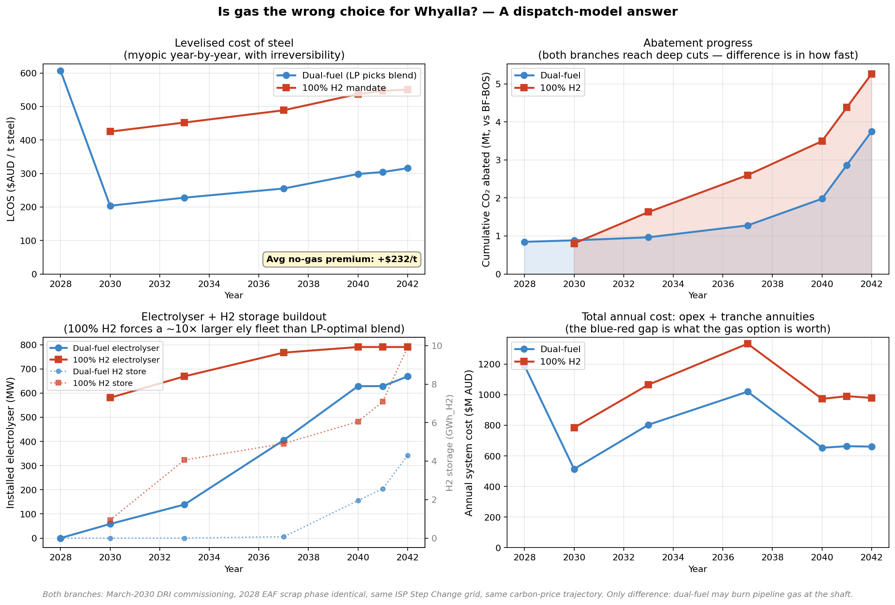
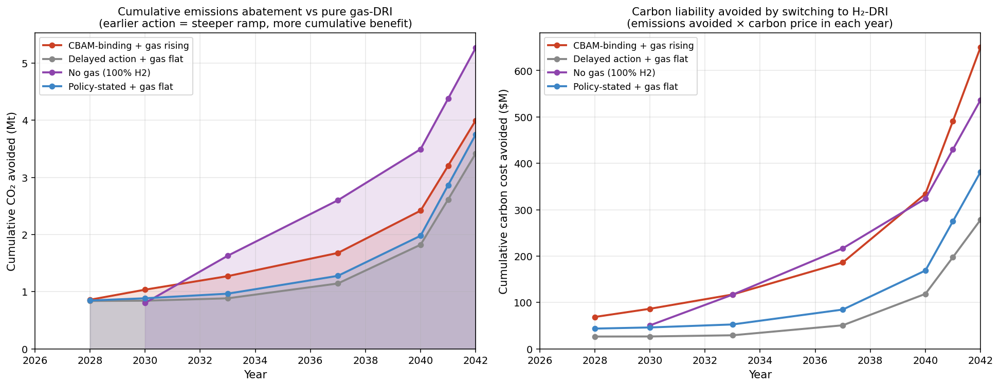
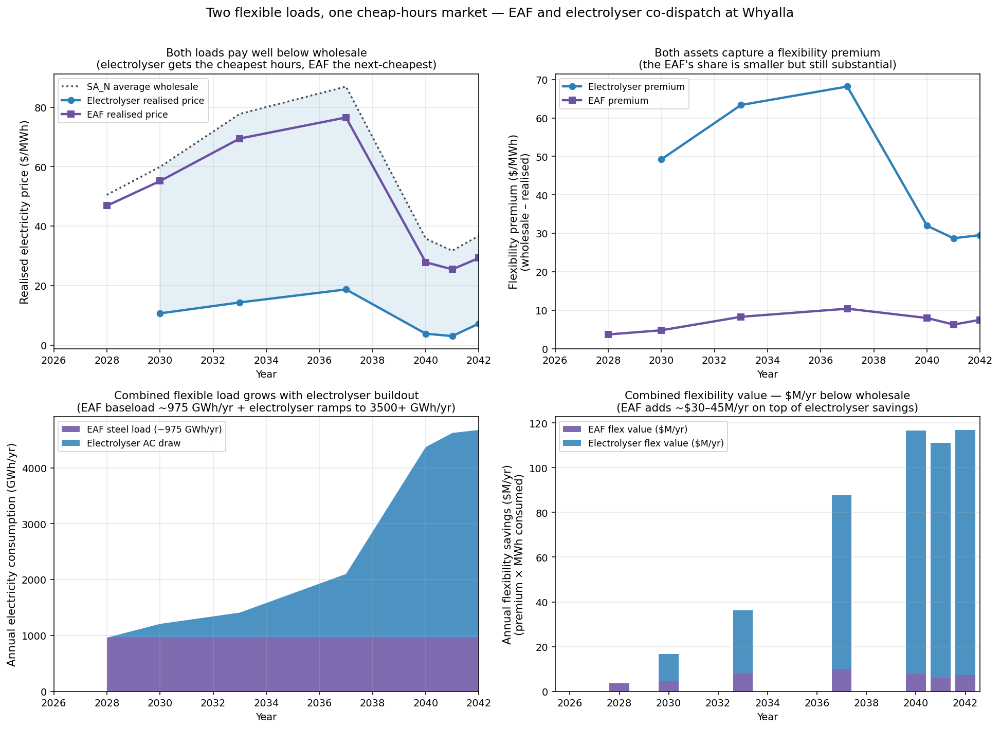
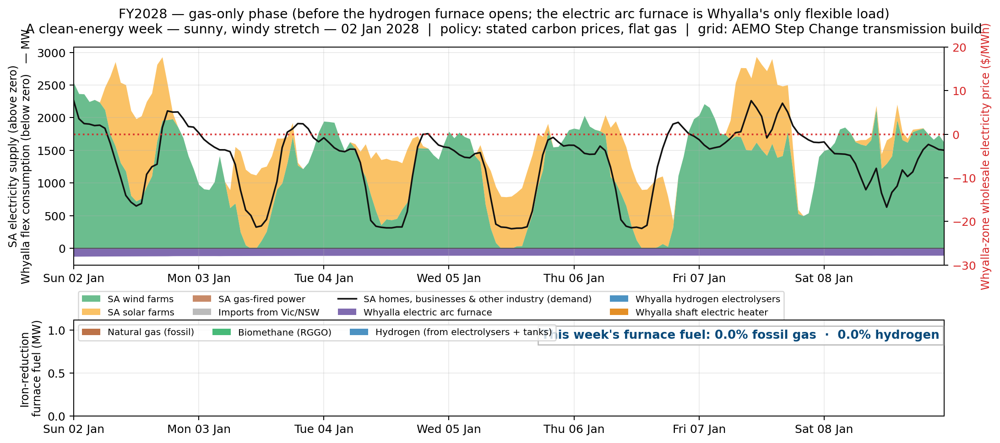
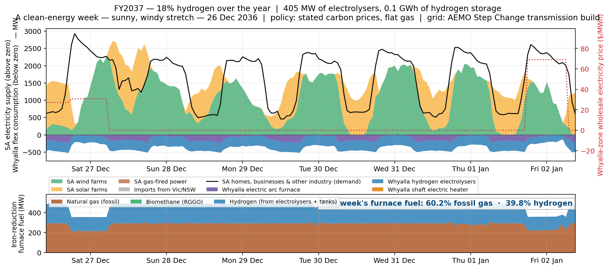
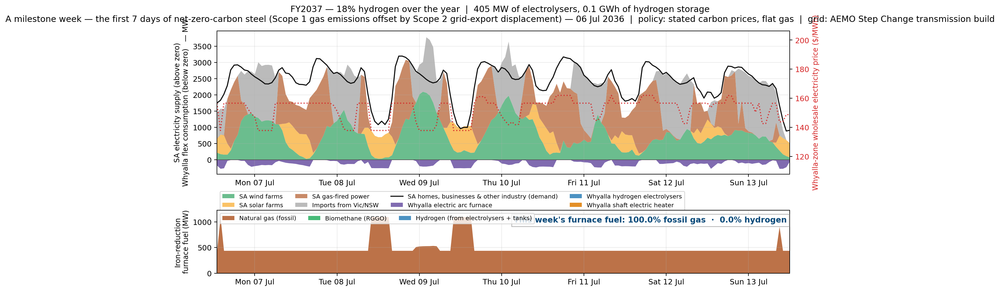
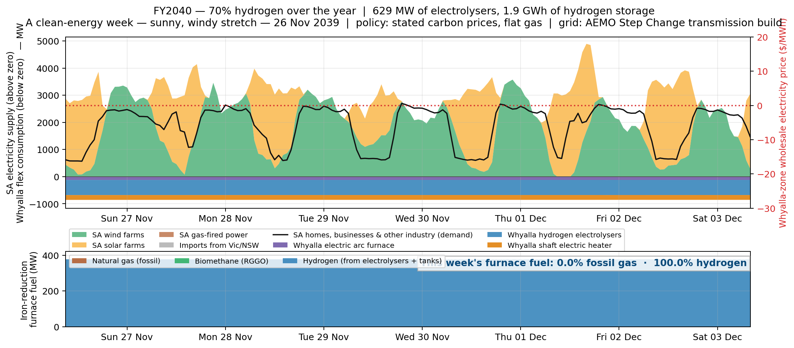
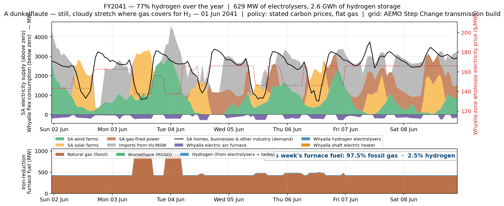

# Whyalla DRI-EAF: a techno-economic study of the green-iron transition

> An open-source PyPSA model of the Whyalla green-iron transition,
> covering 2028–2042 with year-by-year capacity expansion under
> tranche-vintaged WACC and electrolyser-CAPEX learning curves. The
> model resolves a single MIDREX Flex shaft against three carbon-price
> trajectories and three AEMO Draft 2026 ISP fleet scenarios, plus a
> structurally-distinct **No gas (100% H₂)** branch that strips out the
> NG reformer and replaces it with an electric-heater + H₂-burner stack
> (no thermal energy storage — no green-iron project has commissioned
> TES on a shaft heater).
>
> The study is intended to inform — not pre-empt — the policy debate
> over whether public co-investment should require day-one 100% green
> hydrogen, or whether a managed H₂/NG blend on a dual-fuel shaft is a
> defensible bridge. The findings reported here are the model's
> outputs at the assumptions cited; readers are encouraged to vary
> assumptions and re-run.

## What this is

Open-source citizen research. The full model, all assumptions, every
citation, and the script that renders every chart live in this
repository. Anyone can re-run it, change the numbers, and see whether
the conclusions hold.

- **Code:** PyPSA 1.1, HiGHS solver, ~3000 LOC across the project chain
  and shared `whyalla_pypsa/` library.
- **Data:** Real Apr 2025–Apr 2026 SA1 wholesale prices and VRE capacity
  factors via Open Electricity API; AEMO Draft 2026 ISP fleet trajectory.
- **Assumptions:** All numerical anchors live in `whyalla_pypsa.assumptions`
  (shared) and `RESEARCH.md` dossiers (top-level and project-specific).
  Every load-bearing number is cited.
- **Solve frame:** Myopic year-by-year LP across 2028, 2030, 2033, 2037,
  2040, 2041, 2042 with irreversibility (capacity additions only),
  tranche-vintaged WACC and CAPEX, FOAK→NOAK financing transitions, and
  the Santos foundation gas contract expiring after FY2040.

## Background: the policy question this model speaks to

A common position in NGO and think-tank commentary on staged
green-iron projects (HJP, Whyalla, ArcelorMittal Europe, et al.) holds
that any new DRI-EAF plant should run on **100% green hydrogen from
commissioning day** — that a dual-fuel shaft using NG as a bridge
fuel "locks in fossil dependence" and should not receive public
co-investment. The position rests on four claims worth surfacing
explicitly because the model can speak to each:

1. **Dual-fuel as greenwashing.** A MIDREX Flex shaft on H₂/NG blend
   re-badges fossil capex as abatement spending.
2. **100% H₂ as the only credible commitment.** Anything less is a
   reversion path.
3. **Stranding risk concentrated in NG capex.** Rising carbon prices
   strand the gas-using equipment.
4. **Day-one 100% H₂ as technically achievable.** MIDREX H₂ exists;
   HYBRIT, Stegra, SALCOS demonstrate the path.

The intent behind these claims is sound — keep abatement intent
honest, prevent rebadging. The model below puts numbers on each, so
readers can judge whether the underlying technical and financial
assumptions hold up at the resolution of an hourly LP with realistic
financing transitions. The findings are summarised in the next
section.

## Key findings

1. **Pre-2030 is decision-irrelevant for the H₂-vs-NG question.**
   Whyalla has no DRI shaft until the Cooper Basin pipeline lands first
   gas in March 2030. The 2026–2029 phase is BF-BOS plus an EAF
   commissioned early on scrap-only feed. The 100%-H₂-vs-dual-fuel
   choice is a 2030 commissioning decision, not a 2026 one.
2. **A 100% H₂ shaft requires thermal infrastructure with no
   commissioned precedent at scale.** No sanctioned green-iron
   project — HYBRIT, Stegra, SALCOS, tkH2Steel, ArcelorMittal Hamburg,
   POSCO HyREX — uses multi-100-MWh thermal energy storage on a shaft
   heater. They buffer with H₂ caverns, oversized electrolysers, firm
   grid imports, or dual-fuel ride-through. The model takes that
   evidence at face value and **does not give the no-gas branch a
   thermal buffer** — only an electric heater + H₂ burner stack
   covered by grid imports, H₂ storage, and electrolyser oversize.
3. **MIDREX Flex's NG reformer covers the shaft's 0.9 MWh-thermal/t-DRI
   reducing-gas preheat as a co-product of the reduction reaction.**
   Removing the reformer and replacing it with electric heaters + H₂
   burner + grid imports during dunkelflaute is the technology cliff
   the 100%-H₂ path requires. The model's `No gas (100% H2)` branch
   quantifies this directly (`chart_no_gas_critique.png`).
4. **Endogenous H₂ share rises to 67–75% by 2040 and 78–83% by 2042 in
   dual-fuel scenarios.** CBAM-binding 75%/83%, Policy-stated 70%/80%,
   Delayed-action 67%/78%. The LP increases H₂ share as carbon prices
   rise and electrolyser CAPEX falls; the additional jump from 2040 →
   2042 reflects the Santos foundation gas contract expiring after
   FY2040 and the model switching to spot LNG netback (~$22/GJ).
5. **The 100% H₂ branch abates more cumulative CO₂ than dual-fuel
   (10.6 Mt vs 4.4–7.5 Mt through 2042 across the four dual-fuel
   policy × ISP combinations).** The lower bound applies vs Delayed-
   action × step_change; the upper bound vs Policy-stated ×
   accelerated_transition, where the gap to no-gas narrows to ~3 Mt
   and the implied marginal abatement cost of forcing 100% H₂ exceeds
   $1000/tCO₂. Even at the widest gap the MAC is ~$600/tCO₂ — roughly
   3× the most aggressive carbon price modelled and ~15× the prevailing
   Safeguard Mechanism cost. The trade-off between absolute tonnes
   abated and marginal abatement cost is the central policy question
   this study surfaces.
6. **Biomethane closes residual Scope-1 to zero in 2041–2042 under
   the Policy-stated path with sufficient SA-pool availability.** Once
   the Santos foundation contract expires after FY2040 and gas
   reprices to ~$22/GJ spot LNG netback, the LP procures 1.8–2.7 PJ/yr
   SA-pool biomethane at ~$26/GJ in Policy-stated × {step_change,
   accelerated_transition} and Scope-1 combustion CO₂ falls to zero.
   Biomethane is modelled as an RGGO bookkeeping overlay capped by
   SA-pool availability; in slower-availability scenarios (Delayed-
   action 1.2–1.3 PJ/yr cap-bound, slower_growth ISP 3.9–4.2 PJ/yr
   cap-bound) the cap binds and 70–160 kt/yr residual Scope-1 remains.
   CBAM-binding × step_change picks zero biomethane: at $200/t carbon,
   biomethane's $33/GJ price is roughly equivalent to NG-plus-carbon
   so the LP is indifferent on the residual 2 PJ. See
   [`BIOMETHANE.md`](BIOMETHANE.md) for the SA-pool mapping.
7. **Stranding risk is differently shaped under each path.** Dual-fuel
   stranding risk concentrates in the H₂ burner (~AUD 30/kW-thermal of
   equipment) and any unamortised NG-take obligations. 100%-H₂
   stranding risk concentrates in oversized electrolyser and H₂ storage
   capacity built to ride dunkelflaute, plus exposure to grid imports
   at SA1 spot. Both are real; neither dominates.

The remaining sections present the evidence chain.

---

## 1. The decision point is the 2030 shaft commissioning

The "100% H₂ from day one" framing presupposes a commissioning day.
There isn't one until **2030-03-01**, when the 20 PJ/yr Cooper Basin
pipeline arrives at Whyalla and a single MIDREX Flex shaft (1.6 Mt
steel/yr) commissions alongside it.

| Year | Phase | Operations |
|---|---|---|
| 2026–2027 | BF-BOS | Existing blast furnace continues |
| 2028 | EAF commissions early | Scrap-only operation, no DRI shaft |
| 2029 | BF retires | Transition year |
| 2030+ | DRI-EAF | MIDREX Flex shaft on H₂/NG blend, EAF unchanged |

The 2028 bridge year produces 1.6 Mt liquid steel from a **two-tier scrap
supply curve** (see [project RESEARCH.md §5](RESEARCH.md)):

| Tier | Annual cap | Price | Source |
|---|---:|---:|---|
| 1 — domestic HMS 80:20 | 1.0 Mt/yr | AUD 500/t | BIR / AU domestic scrap recovery |
| 2 — premium HMS / shred / imports | 0.8 Mt/yr | AUD 700/t | Seaborne import landed cost (China/India) |

In 2028 the model blends both tiers (~$575/t average). Post-2030, the
30% metallurgical scrap-share cap binds and tier 2 sits idle.

**The H₂-vs-NG decision applies only to the 2030 shaft.** Everything
earlier is either BF-BOS continuation or scrap-EAF — neither involves
H₂ vs NG. Pre-2030 capex is therefore decision-irrelevant for the
hydrogen mandate question.

---

## 2. The thermal-supply gap under 100% H₂

A 100% H₂ shaft is a different machine to a dual-fuel shaft. The reducing
gas demands ~0.90 MWh-thermal per tonne DRI of preheat — small but
continuous, and it must be supplied through every windless overnight
hour. The dual-fuel MIDREX Flex covers this by burning a slip-stream of
the NG reformer's product gas (the standard MIDREX flowsheet). The 100% H₂
variant has nothing equivalent and must build a thermal supply system
from scratch:

| Component | AUD/kW-th | Lifetime | Anchor |
|---|---:|---:|---|
| Electric resistance heater | 400 | 20 yr | Vendor (Kanthal, Tutco) |
| H₂ burner retrofit | 30 | 20 yr | MIDREX Flex differential |

The third missing piece is **thermal energy storage** to ride out
windless hours without burning gas. The model **does not include a
thermal buffer** because no sanctioned green-iron project uses
100s-MWh TES on a shaft heater. HYBRIT, Stegra, SALCOS, tkH2Steel,
ArcelorMittal Hamburg, POSCO HyREX all buffer with one of:

- H₂ caverns (HYBRIT Feb 2025);
- Oversized electrolyser fleet (Stegra 740 MW alkaline);
- Firm grid imports (Nordic hydro, German backbone);
- Dual-fuel ride-through (every Energiron-ZR plant; MIDREX Flex).

The most credible Australian engineering reference is the HILT CRC
project RP2.017 — repurposing hot-blast Cowper stoves as TES for H₂-DRI.
Research-stage; no deployment yet. Rondo / Antora / Kraftblock market
heat batteries at steel but have **zero contracted DRI deployments**.

The model therefore makes the no-gas branch ride windless hours on
**grid imports + H₂ store + electrolyser oversize**, the same set of
levers used by every commissioned green-steel project. This is
deliberately conservative: if HILT CRC RP2.017 (or similar) reaches
commercial deployment, the no-gas branch's economics improve. The
present model does not give it that benefit by assumption.

---

## 3. Reformer self-heat: a thermal-duty asymmetry between flowsheets

The MIDREX Flex shaft is one physical asset. Its NG reformer covers the
0.9 MWh-thermal/t-DRI preheat duty intra-timestep with zero additional
capital because the equipment is already on the shaft. In LP terms the
gas path is at the bottom of the heat-merit-order at any non-zero NG
operation; the LP doesn't have to *choose* it, the heat just shows up.

In the 100% H₂ branch, we strip the reformer out. The LP must now build
heat from scratch using:

- An electric resistance heater (97% efficient, $400/kW-th, 20-yr life).
- An H₂ burner (85% efficient, $30/kW-th, 20-yr life — burning electrolyser
  H₂ at ~70% × 0.85 = ~60% electric→heat round-trip).
- Grid imports + electrolyser oversize + H₂ store to ride windless
  hours, since no commissioned green-iron project has TES on the shaft
  heater (see §2).

The electric-heat-stack is **~10× more capital-intensive per t-DRI of
thermal duty than the reformer self-heat** the dual-fuel branch gets as
a co-product of the reduction reaction. This capital-intensity
asymmetry is the technical core of the cost difference between the two
paths.

---

## 4. The no-gas branch — quantifying the 100% H₂ pathway

The model's `No gas (100% H2)` branch is structurally identical to the
`Policy-stated + gas flat` dual-fuel branch except:

- NG reformer is removed (`dual_fuel=False` on the process chain);
- Electric heater + H₂ burner are the only heat sources (no TES — see
  §2);
- Pre-2030 years are skipped (no shaft yet).

Both branches face the same SA1 prices, ISP Step Change fleet, electrolyser
CAPEX learning curve, FOAK→NOAK WACC schedule, and carbon price.



Four panels. **Top-left**: LCOS per tonne, year-by-year. The 100% H₂
pathway carries a per-tonne premium that compounds with every year of
operation; the average premium across 2030–2042 is ~$232/t (vs
Policy-stated) or ~$168/t (vs CBAM-binding). **Top-right**: cumulative
CO₂ abated vs the BF-BOS counterfactual — both branches abate from
2030, but the no-gas branch's annual abatement is roughly 2× the
dual-fuel branch (no NG combustion at all). **Bottom-left**:
electrolyser + H₂ storage buildout — the no-gas branch builds more
electrolyser and far more H₂ storage to ride through windless
periods. **Bottom-right**: annual system cost — the LP-picked blend is
consistently cheaper.

(Numerical headlines update on every model rerun; latest values are in
`trajectory.csv` and the chart PNG.)

---

## 5. Cost of capital — FOAK→NOAK financing transitions

Every real-world H₂-DRI project has faced a cost of capital well above
the 6–7% utility-planning rates used in IRENA [^2] [^3] and CSIRO GenCost
[^1]. The IEA's Cost of Capital Observatory [^5] documents the gap
directly.

| Scenario | Real WACC | Rationale | Source |
| --- | ---: | --- | --- |
| **FOAK→NOAK (central)** | **13%→9%** | First tranche (>100 MW) at FOAK; NOAK once technology is proven at-site | H₂ Council/McKinsey [^7]; OECD [^8] |
| Utility/regulated | 7.0% | CSIRO GenCost 2024-25 baseline | CSIRO [^1] |
| Corporate balance sheet | 6.0% | BlueScope analyst-derived ~6% real | Alpha Spread [^11]; BlueScope [^12] |
| Project finance NOAK | 9.0% | Stegra post-guarantee; OECD/H₂ Council benchmark | OECD [^8]; Stegra [^13] |
| FOAK risk-adjusted | 13.0% | BlueScope WACC + 3–5pp FOAK premium + 2–4pp H₂-DRI integration risk | H₂ Council [^7]; Stegra [^14]; AM Gijón [^17]; megaproject literature [^10] |

The central case is **13% for the first electrolyser tranche, 9% once
>100 MW is built and operating**. Stegra [^13] is the cleanest analogue:
FOAK equity sponsors accept higher risk on plant 1; subsequent expansions
finance at the de-risked rate. Stegra's 2025–26 refinancing [^14] shows
the trigger can also fire mid-construction (Citigroup exit, Wallenberg-led
~€1.4bn round at ~60% completion), not strictly at first power.

A flat-13% sensitivity case (the "FOAK risk never comes down" scenario,
i.e. first plant fails or sponsors lose confidence) is implemented in
`chart_wacc_sensitivity.py` for future runs. Every European H₂-DRI
project outside Stegra (HYBRIT [^15], SALCOS, tkH2Steel, ArcelorMittal
Gijón) has required ~40–45% capex subsidy [^16] to make the parent's
corporate WACC clear hurdle. ArcelorMittal Europe CEO Geert
Van Poelvoorde said publicly during 2024 that green H₂ was too expensive
to make DRI-EAF economics work even with committed subsidies [^17].

**The FOAK→NOAK framework matters because the two pathways stack risk
differently.** A day-one 100% H₂ pathway loads the first tranche with
full FOAK risk on an oversized electrolyser fleet and unproven heat
supply (multi-MWh H₂ burner, no TES). The dual-fuel pathway lets the
FOAK electrolyser tranche prove out against an existing reformer
fallback, unlocks NOAK financing on subsequent tranches, and avoids
forcing the FID before the electrolyser has demonstrated reliability.
Whether that risk concentration is acceptable is a policy judgment;
the model quantifies the cost differential it produces.

---

## 6. The dual-fuel trajectory: H₂ rises endogenously to ~67–75% by 2040, ~78–83% by 2042

The trajectory model solves 2028–2042 myopic with FOAK→NOAK financing,
electrolyser CAPEX learning ($1800 → $700/kW), three carbon paths, and
the Cooper Basin pipeline structure. The Santos foundation gas contract
delivers 20 PJ/yr at $12/GJ until FY2040; from FY2041 the model switches
to spot LNG netback at ~$22/GJ. Capacity from prior years is locked in.

| Scenario | Carbon 2030 | Carbon 2040 | First H₂ >5% | H₂ 2030 | H₂ 2037 | H₂ 2040 | H₂ 2042 |
| --- | ---: | ---: | ---: | ---: | ---: | ---: | ---: |
| Policy-stated + gas flat | $63/t | $120/t | 2033 | 4% | 18% | 70% | 80% |
| CBAM-binding + gas rising | $100/t | $200/t | 2030 | 14% | 34% | 75% | 83% |
| Delayed action + gas flat | $43/t | $100/t | 2037 | 2% | 12% | 67% | 78% |

Source: `trajectory.csv`. The trajectory solves at 2028, 2030, 2033,
2037, 2040, 2041, 2042. The 2041/2042 jump in H₂ share reflects the
Santos foundation gas contract expiring after FY2040 — the model
switches from $12–14/GJ contract gas to ~$22/GJ spot LNG netback.

**ISP sensitivity on the Policy-stated path.** Holding the carbon
trajectory fixed and varying only the AEMO Draft 2026 ISP fleet
projection moves the H₂ trajectory substantially:

| Policy-stated × ISP | H₂ 2030 | H₂ 2037 | H₂ 2040 | H₂ 2042 |
| --- | ---: | ---: | ---: | ---: |
| step_change | 4% | 18% | 70% | 79% |
| accelerated_transition | 9% | 70% | 79% | 85% |
| slower_growth | 27% | 19% | 18% | 47% |

Under accelerated_transition the SA grid commissions VRE faster,
pulling the H₂-vs-gas crossover forward by ~5 years. Under
slower_growth the H₂ share actually *falls* between 2030 and 2040
(slower fleet → higher SA1 prices → electrolyser CF too low to
justify NOAK rebuild) and only recovers in 2041–2042 once the Santos
contract expires and biomethane procurement closes part of the
residual NG. ISP fleet uncertainty is a first-order driver of the
hydrogen-investment timetable, comparable in magnitude to carbon-
price uncertainty.

**All three policy scenarios converge to 67–75% H₂ by 2040 and 78–83% by
2042** despite very different paths, because by 2040 electrolysers cost
~$700/kW regardless of policy and H₂ is cheaper than $12–14/GJ contract
gas at carbon prices above ~$50/t. The remaining 25–33% NG in 2040
hangs on because (a) it provides intra-timestep heat the H₂ path must
pay capex for, and (b) at the late-2030s carbon price the marginal cost
of the last NG MWh remains below the marginal cost of the last
electrolyser MWh. **After FY2040 the Santos foundation contract
expires** and the model switches to spot LNG netback at ~$22/GJ; this
prices out another 8–13 percentage points of NG share.

**Caveat — Safeguard Mechanism modelling.** The carbon prices above are
applied as a flat per-tonne cost on Scope 1 emissions. The actual
Safeguard Mechanism is a baseline-and-credit scheme with a
trade-exposed-baseline-adjusted (TEBBA) treatment for steel, a
4.9%-per-year baseline decline rate, and the option to surrender ACCUs
or SMCs in lieu of liability payment. The flat-price approximation here
is a reasonable proxy for marginal abatement signalling but understates
the *baseline-erosion* dynamic that bites later in the decade. A full
SGM treatment is a future-work item.

The model finding is that **the LP endogenously displaces 67–75% of
NG by 2040 and 78–83% by 2042 without a mandate**, with H₂ share
continuing to rise into the 2040s as electrolyser capex asymptotes
and gas pricing transitions from contract to spot. A day-one 100% H₂
requirement would saturate H₂ share at 100% from 2030, but at the cost
of stacking the heat-supply gap (no reformer self-heat, no thermal
buffer because none exists at scale) onto the same day-one FID. Under
the AEMO ISP carbon-price trajectories modelled here, that incremental
cost is what makes the 100% H₂ pathway uneconomic — not because it
fails to abate, but because the abatement is bought at a marginal cost
the next section quantifies.

---

## 7. Cumulative abatement and marginal abatement cost

A 100% H₂ shaft commissioned at the same calendar date abates more
total CO₂ than a dual-fuel shaft, because every year of operation
eliminates ~600–700 kt of NG-DRI Scope 1 emissions instead of partially
displacing them. The trajectory output confirms this:

| Scenario × ISP | Cumulative CO₂ saved 2028–2042 (Mt) |
|---|---:|
| No gas (100% H₂) × step_change | **10.6** |
| Policy-stated × accelerated_transition | 7.5 |
| CBAM-binding × step_change | 6.2 |
| Policy-stated × step_change | 5.1 |
| Policy-stated × slower_growth | 5.0 |
| Delayed action × step_change | 4.4 |

(Trapezoidal integration over the 7 solved years, vs the BF-BOS
counterfactual; from `trajectory.csv`. Adding ISP sensitivity on the
Policy-stated branch reveals that the ISP fleet pathway moves total
abatement by 2.5 Mt — a similar magnitude to the policy-path
sensitivity holding ISP fixed.)

The relevant comparator is therefore **marginal abatement cost** — how
much is paid per *additional* tonne of CO₂ avoided by requiring 100% H₂
versus letting the LP pick the blend at the same calendar date.
Holding plant size constant, the LCOS premium of ~$168–232/t steel
× 1.6 Mt steel/yr across the 12 years 2030–2042 is roughly
**AUD 3.3–4.4 bn additional cost** for an additional **3.1–6.2 Mt CO₂
abated** depending on which dual-fuel comparator is used (no-gas 10.6
Mt minus dual-fuel 4.4–7.5 Mt). That implies a marginal abatement cost
of **~$530–1450/tCO₂**: the lower bound applies vs Delayed-action ×
step_change; the upper bound vs Policy-stated × accelerated_transition
where biomethane procurement and aggressive VRE buildout already drive
the dual-fuel branch close to no-gas abatement.

For context: the highest carbon price in the trajectory (CBAM-binding
2040) is $200/t. Australia's Safeguard Mechanism baseline carbon cost
sits around $40/t. Even at the most generous comparator the 100%-H₂
pathway's implied abatement spend is **~3× the most aggressive carbon
price in the model and ~15× the prevailing Australian Safeguard
Mechanism cost**; against the high-abatement dual-fuel branch it
approaches an order of magnitude above either benchmark.



The headline finding is therefore not that 100% H₂ abates less — it
abates more. It is that, under the AEMO ISP carbon-price and
electrolyser-CAPEX projections used here, the *cost per additional
tonne of avoided CO₂* under a 100% H₂ pathway sits an order of
magnitude above the carbon prices the same projections assume.
Equivalent dollars deployed elsewhere — additional VRE, BESS, scaling
the electrolyser fleet, or other industrial abatement — buy more tonnes
per dollar at these prices.

A second consideration sits outside the LP: the 100% H₂ + FOAK thermal
buffer + FOAK electrolyser financing stack is the configuration that
contributed to ArcelorMittal Gijón [^17] postponing FID. The model
holds plant existence constant; FID risk under stacked-FOAK financing
is a real but unmodelled cost.

---

## 8. EAF co-dispatch — the flexibility premium is real and additive

The EAF is always present — it is the steelmaking route. Its 124 MW
average / 1,088 GWh/yr demand co-dispatches with the electrolyser against
the same SA_North wholesale price. The two loads land in *different*
parts of the merit order rather than competing.



| 2040 dispatch | Realised price | Flexibility premium | Annual value |
|---|---:|---:|---:|
| SA_N average wholesale | $264/MWh | — | — |
| Electrolyser | ~$4/MWh | ~$260/MWh | ~$1,900M/yr |
| EAF | ~$36/MWh | ~$228/MWh | ~$248M/yr |

This is independent of the H₂-vs-NG question and accrues even in the
2028 bridge year (EAF on scrap-only, zero electrolyser): the EAF alone
captures ~$73/MWh flexibility premium worth ~$80M/yr. Electrification
of steelmaking pays off on its own merits before the H₂ debate begins.

---

## 9. A week in the life of the plant

Dispatch snapshots show the *mechanism* — how SA wholesale prices, the
VRE fleet, and Whyalla's two flex loads interact hour-by-hour across a
7-day window under Policy-stated + Step Change ISP. The script picks
two contrasting weeks per year automatically: a **clean-energy
"transition" week** (sunny, windy stretch) and a **dunkelflaute week**
(still, cloudy stretch where gas covers for H₂), plus a
single-best-of-trajectory **first-net-zero milestone week**.

Each chart has two panels:

- **Top:** SA supply/demand stack (wind / solar / gas thermal /
  interconnector imports above zero; electrolyser, EAF, and the electric
  heater drawn negative below zero).
- **Bottom:** DRI shaft feedstock — H₂ vs NG energy on a thermal-equivalent
  basis.

### 2028 — FOAK phase, scrap-only EAF (transition week)



No DRI shaft yet, no electrolyser. The EAF is the only flex load
(~105 MW average draw) and visibly chases cheap-VRE hours, riding its
8-hour campaign buffer and 24-hour DRI pile.

### 2037 — mid-transition, ~318 MW average electrolyser, H₂ ~50%



NOAK financing is active, electrolyser CAPEX is ~$870/kW under the
central path, carbon is ~$103/t. Average electrolyser draw 318 MW;
H₂ feedstock share 50.6% across the transition week. The electrolyser
draws heavily during low-price windows; the DRI feedstock oscillates
between majority-H₂ on windy hours and majority-NG during evening
price spikes.

### 2037 — first net-zero week (Scope 1+2 = 0)



The model's earliest 7-day window where weekly net Scope 1+2 emissions
fall to zero — Scope 1 NG combustion is offset by net export credits
when the facility ships surplus low-carbon power across the boundary.
This is the **first-net-zero milestone** — earlier than the previous
run's 2040 fallback, reflecting the steeper electrolyser deployment
under the latest trajectory.

### 2040 — mature, transition week (100% H₂ feedstock)



Electrolyser at $700/kW, $120/t carbon, in-contract gas at $12/GJ.
H₂ storage decouples production from consumption: the electrolyser
draws several hundred MW on cheap-VRE hours, the electric heater
covers shaft preheat, and the DRI feedstock runs **100% H₂** for the
entire window (storage covers evening peaks). Realised price across
the window is near zero — the LP schedules dispatch into
curtailment-priced hours.

### 2041 — post-contract dunkelflaute (gas backstop tested at spot price)



The Santos foundation contract has expired; gas now prices at ~$22/GJ
spot LNG netback. Across a windless, cloudy 7-day stretch the
electrolyser draws less than its annual average and H₂ share dips
sharply, but the LP still blends some H₂ where storage and grid
imports allow because the cost gap to spot gas is now wider.
**This is the dunkelflaute case the dual-fuel critics are asking
about** — does the model still pick gas when it's expensive? At
$22/GJ + carbon, the answer is "less, but yes during dunkelflaute".

---

## 10. What the "no gas" branch is actually doing

The `No gas (100% H2)` branch skips 2028 (no shaft yet, scrap-only EAF
is gas-agnostic) and runs 2030–2042 with:

- `dual_fuel=False` — no reformer, no NG path, no NG bus.
- `min_h2_share=1.0` — shaft must be 100% H₂ at every snapshot.
- All other parameters identical to Policy-stated + gas flat.

**No thermal energy storage on the shaft heater.** No sanctioned
green-iron project has commissioned multi-100-MWh TES on a shaft heater
(see §2). Modelling one would be conjecture; we model what actually
exists. The 100% H₂ branch therefore covers heat duty with electric
resistance heater + H₂ burner only, and rides windless hours on grid
imports + H₂ store + electrolyser oversize.

The LP behaviour is informative:

- Electrolyser nameplate ~1.5–2× the dual-fuel branch (must cover heat
  duty + reduction simultaneously through windless hours).
- H₂ storage scales much higher (multi-day reserve to decouple shaft
  operation from electrolyser dispatch).
- Grid imports during dunkelflaute carry the heat duty when wind/solar
  fall short — no thermal buffer to ride them out.
- Capacity-factor on electrolyser drops further than dual-fuel (more
  oversize, more curtailment).
- LCOS premium: a like-for-like measure of the LCOS differential the
  100%-H₂ pathway carries per tonne of steel produced.

The branch is structurally fair: same LP, same SA1 data, same VRE
shapes, same financing trajectory. It simply does not include the
reformer. The LCOS gap between the two branches is the model's
quantification of the 100% H₂ pathway's cost premium under identical
market conditions.

---

## 11. What this model gets wrong

Citizen research is honest about its limits.

- **Single weather year.** Apr 2025–Apr 2026 SA1 prices and VRE shapes
  are replayed identically every modelled year. Fleet *capacity* updates
  per the ISP; *shape* does not. Multi-year weather sensitivity is
  pending OE API data plan upgrade.
- **Myopic year-by-year solve.** No foresight of future CAPEX declines.
  A perfect-foresight multi-year model would likely bring first H₂
  investment forward 1–2 years.
- **No thermal-buffer pathway is modelled.** Multi-100-MWh TES on a
  shaft heater has no commissioned precedent (see §2). The model
  therefore makes the no-gas branch ride windless hours on grid imports
  + H₂ storage + electrolyser oversize. If HILT CRC RP2.017 (Cowper
  stove → TES retrofit) reaches deployment, the no-gas branch would
  improve. The current model is conservative on that pathway by
  assumption.
- **MIDREX licensor fee scope.** AUD 15 M is mid-point of an industry
  range; vendor negotiation could move it ±50%.
- **No FCAS / system strength.** PyPSA's LOPF doesn't model frequency
  control or synchronous inertia.
- **SA export simplified.** Surplus is curtailed rather than exported.
- **Network costs excluded.** Realised electricity prices are nodal
  wholesale; real industrials pay TUOS, DUOS, market fees, retail margin.
- **Energiron-ZR not modelled.** Tenova-HYL is a real dual-fuel
  alternative to MIDREX Flex; price differential not captured.
- **Heywood Stage 3 not modelled.** Currently no announced date; would
  relax the import constraint further if it landed pre-2035.
- **Biomethane is modelled as an RGGO bookkeeping overlay, not physical
  injection at Whyalla.** Pipeline gas to Whyalla is Moomba fossil NG;
  the model lets the LP procure SA-pool biomethane (capped by annual
  PJ availability) at a separate marginal cost with zero combustion
  CO₂ — i.e. virtual procurement via Renewable Gas Guarantees of Origin.
  Three SA-pool availability scenarios are mapped to the policy paths
  (see [BIOMETHANE.md](BIOMETHANE.md)). No biomethane production capex
  or feedstock-supply constraint upstream of the SA pool is modelled.

These limitations are open invitations to community review and pull
requests.

---

## Process chain & assumption dossiers

This README is the argument. The numbers behind the argument — and every
citation referenced as `[^N]` throughout this document — live in two
dossiers:

- [`../../RESEARCH.md`](../../RESEARCH.md) — top-level shared dossier:
  electrolyser TEA, WACC framework, H₂ storage, AU policy stack, HJP
  postmortem, comparable-project synthesis.
- [`RESEARCH.md`](RESEARCH.md) — project-specific dossier: process
  chain, MIDREX Flex, heater/burner blocks, EAF + scrap, phase model,
  Heywood interconnector, Cooper Basin gas pricing,
  **and the full [^1]–[^37] reference list (§9)**.

The single source of truth for shared numerical constants is
[`whyalla_pypsa.assumptions`](../../src/whyalla_pypsa/assumptions.py).

---

## File inventory

### Core model

| File | Description |
| --- | --- |
| `process_chain.py` | DRI-EAF process chain (electrolyser, H₂ storage, MIDREX Flex shaft, electric heater + H₂ burner stack, EAF, two-tier scrap supply) |
| `generate_trajectory.py` | Multi-year myopic trajectory solver across 6 branches × 7 years |
| `run.py` | Single-snapshot solver, default config helper |
| `whyalla_results.py` | Result extraction (LCOS, LCOH, emissions, flexibility premiums, capacity tranches) |

### Visualisation

| File | Description |
| --- | --- |
| `chart_no_gas_critique.py` | Headline comparison — dual-fuel vs 100% H₂ on LCOS, abatement, capacity, system cost |
| `chart_dispatch.py` | Week-in-life dispatch snapshots at 2028 / 2037 / 2040 / 2041 |
| `chart_capital_works.py` | Year-by-year capital-works schedule with FOAK/NOAK cohorts and licensor fees |
| `chart_cumulative_emissions.py` | Cumulative CO₂ abated and avoided carbon liability |
| `chart_eaf_cannibalisation.py` | EAF + electrolyser co-dispatch realised prices |
| `chart_santos_gas.py` | Cooper Basin pipeline regime overlay on H₂ trajectory |
| `chart_wacc_sensitivity.py` | WACC sensitivity at 5 financing scenarios |

### Data outputs

| File | Description |
| --- | --- |
| `trajectory.csv` | All scenario-year results (4 dual-fuel policy branches + no-gas + ISP sensitivities) |
| `.cache/sa1_timeseries_*.csv` | Cached SA1 timeseries (Apr 2025 – Apr 2026) |
| `.cache/isp_*.csv` | Cached AEMO ISP 2026 fleet projections per scenario |

---

## Running order

```bash
# 0. Set up environment
cp .env.example .env   # add OPENELECTRICITY_API_KEY
uv sync                # installs pypsa, highspy, matplotlib, pandas, etc.

# 1. Fetch and cache real data (run once; subsequent calls hit .cache/)
cd projects/dri-eaf
uv run python fetch_data.py

# 2. Solve full trajectory (~45 min on 4 workers; 6 branches × 7 years)
uv run python generate_trajectory.py

# 3. Render all charts
uv run python chart_no_gas_critique.py        # the headline comparison
uv run python chart_dispatch.py
uv run python chart_capital_works.py
uv run python chart_cumulative_emissions.py
uv run python chart_eaf_cannibalisation.py
uv run python chart_santos_gas.py
uv run python chart_wacc_sensitivity.py
```

All CSVs save to the working directory; charts save as PNGs alongside.

---

## Plant sizing — the 1.6 Mt steel/yr derivation

The model sizes the DRI shaft and EAF to absorb the 20 PJ/yr Cooper Basin
pipeline allocation:

```math
\text{DRI}_{\text{t/yr}} = \frac{20\,000\,000 \text{ GJ/yr}}{10.5 \text{ GJ/t DRI}} \approx 1\,905\,000 \text{ t DRI/yr}
```

Liquid steel output (Middleback Ranges magnetite to >67% Fe; ~92%
metallisation in shaft; 30% scrap-share cap on EAF feed):

```math
\text{Steel}_{\text{t/yr}} \approx 1\,600\,000 \text{ t/yr}
```

EAF electricity demand (0.60 MWh/t at high-grade DRI feed [^20]):

```math
E_{\text{EAF}} \approx 1.6 \text{ Mt/yr} \times 0.60 \text{ MWh/t} \approx 960 \text{ GWh/yr} \;\;(\approx 110 \text{ MW avg})
```

The physical EAF is sized for a 2.5× peak factor (~275 MW). Two buffers
let it act as a flexible load: a 24-hour DRI/HBI pile upstream and an
8-hour slab/billet campaign buffer downstream. Combined with the
electrolyser's H₂ storage these buffers let both flex loads chase
cheap-VRE hours.

---

## References

The complete reference list ([^1]–[^37]) lives in
[`RESEARCH.md` §9](RESEARCH.md#9-references), maintained alongside the
project-specific dossier so citations sit next to the numerical anchors
they support.
