# Whyalla Synthetic Fuels — A Sovereign Capability Investment Case

**Australia imports ~595 kbpd of jet and diesel — about 80% of total
liquid-fuel demand. Two refineries remain (Lytton and Geelong), both
on Federal life support (FSSP) extended through 2030. National
stockholding sits below the IEA 90-day target. Every drop of fuel
reaching Australian wheels, ships, jet engines, or ADF assets passes
through one of two narrow sea-lanes (Hormuz, Malacca) which Q2 2026
demonstrated are not benign.**

This project models a domestic synthetic-fuels precinct at **Whyalla /
Port Bonython, South Australia** that would replace ~31% of those
imports by 2040 — for a programme cost between JobKeeper and the 2024
Coalition nuclear policy on a per-taxpayer basis, with hard
infrastructure that keeps producing after the policy window closes.

---

## The strategic case

| | |
|---|---|
| Australia's jet + diesel imports | ~32.6 Mt/yr (≈595 kbpd) |
| Proportion of total liquid-fuel demand | ~80% |
| Days of cover (IEA stockholding obligation: 90) | ~30-50 |
| Operating refineries left | 2 (down from 7 in 2003) |
| Both refineries reliant on | Singapore crude condensate routes through Strait of Malacca |
| Key sea-lane choke points to AU | Hormuz, Malacca, Bab-el-Mandeb |
| Known maritime disruption events 2023-26 | 4 (Houthi Red Sea, Q2 2026 Hormuz, two USTC incidents) |

### Where Australia's liquid fuel actually goes

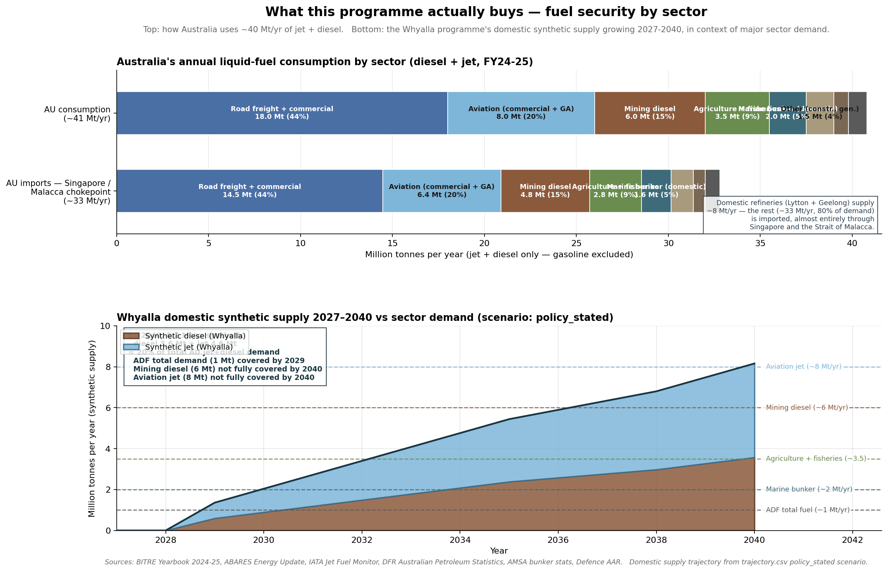

Top panel: how Australia's ~40 Mt/yr of jet + diesel breaks down by
end-use sector — and how much of it currently flows in through the
Strait of Malacca (~80% imported). Bottom panel: the Whyalla
programme's domestic synthetic supply growing from zero in 2027 to
~8 Mt/yr of strategically-relevant diesel + jet by 2040 — enough to
cover the entire Australian Defence Force fuel requirement many
times over and roughly half of either mining diesel or aviation jet.

### What needs liquid fuel — and what doesn't

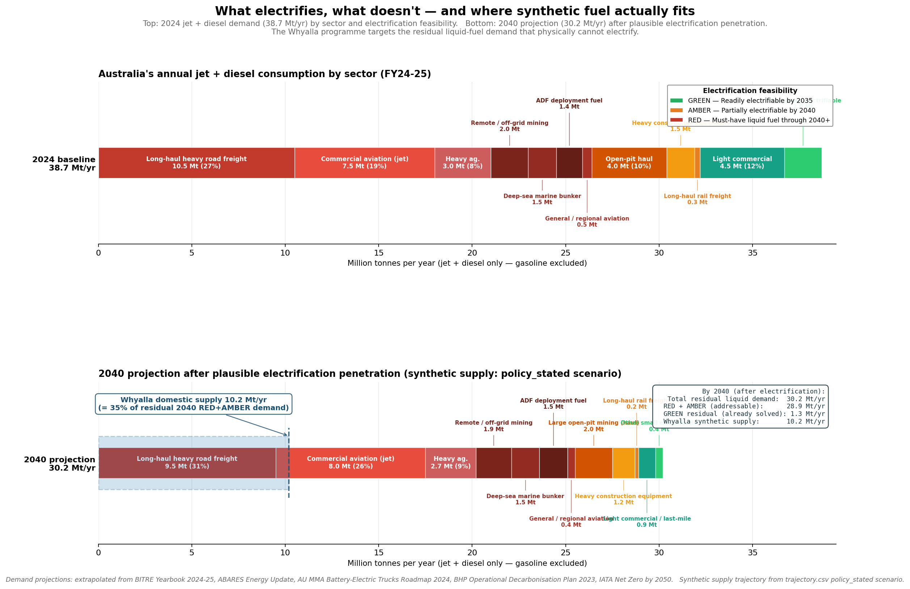

Synthetic fuel is for the sectors that physically cannot electrify
within the policy window. Light-duty road, urban buses, last-mile
delivery, short-haul rail, light agriculture and harbour ferries
already have credible battery-electric pathways with most of their
demand decarbonised by 2040. Long-haul heavy road, aviation, deep-sea
marine, remote off-grid mining, ADF deployment fuel and heavy
construction are the genuine hard-to-electrify residual — about
**28-30 Mt/yr by 2040**, the addressable market for a domestic
synthetic-fuels programme. The Whyalla programme delivers ~10 Mt/yr
of that, **without competing with sectors that batteries already
solve**.

The defence ledger compounds this. The ADF runs on diesel + JP-5/JP-8.
AUKUS submarines are nuclear but their escort fleet, at-sea
replenishment, and basing infrastructure are not. Mining, agriculture,
heavy transport — the Diesel Fuel Rebate beneficiaries that exempt
$10 B/yr of fuel excise — are the strategic primary industries that
underwrite Australia's export economy. None of them have a viable
import-substitute if the sea-lanes close.

**Synthetic fuel made in Australia is the only domestic option that
preserves the existing fleet** (no engine retrofits, no new
distribution network, drop-in compatible with diesel and Jet A).
Battery-electric road transport handles light-duty private vehicles
on a 15-30 year horizon; diesel and jet fuel for heavy transport,
aviation, marine, defence, mining, and agriculture cannot
realistically electrify in that window.

---

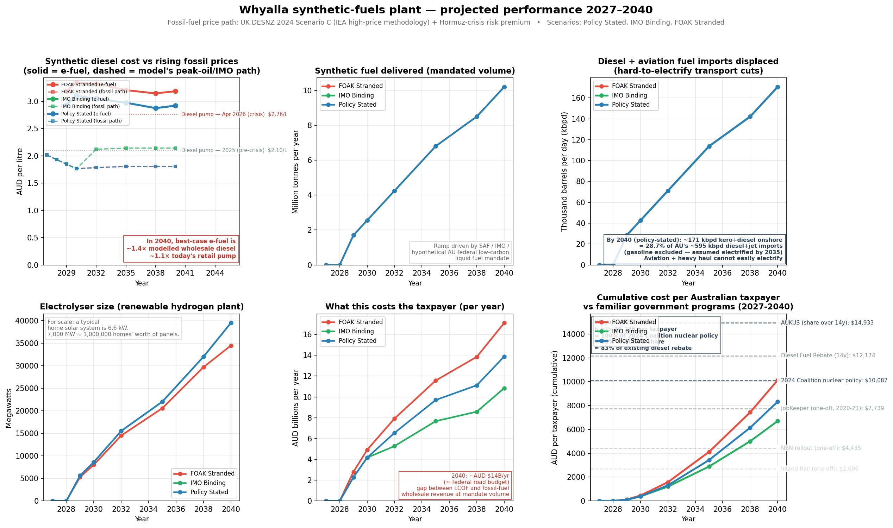

## The proposition

A programme that builds out to **10.2 Mt/yr of finished fuel by 2040**
(≈175 kbpd, ~31% of jet + diesel imports), with cumulative taxpayer
cost over 2027-2040 sitting in the JobKeeper-to-nuclear band:

| Scenario          | What happens                                       | Cumulative cost     | vs JobKeeper | vs Nuclear |
|-------------------|----------------------------------------------------|---------------------|-------------:|-----------:|
| **imo_binding**   | IMO Tier-1 + SAF blending mandates kick in 2032   | **$6,643 / taxpayer** |  86%        |    66%     |
| **policy_stated** | Stated-policies baseline (no new carbon premium)  | **$8,267 / taxpayer** | 107%        |    82%     |
| **foak_stranded** | Slow capex decline + 13% WACC + no policy premium | **$10,126 / taxpayer**| 131%        |   100%     |

**Comparable Australian taxpayer commitments (2027-2040 horizon):**

| Programme                                | Cumulative $/taxpayer | What you get |
|------------------------------------------|----------------------:|--------------|
| **AUKUS** (14-yr share of $368 B / 30 yr)| **$14,943**           | 8 nuclear submarines, late 2030s onwards |
| **Diesel Fuel Rebate** (14 × $10 B)      | **$12,174**           | Excise exemption (no asset created) |
| **2024 Coalition nuclear policy**        | **$10,087**           | 7 nuclear plants, first online 2037 |
| **JobKeeper** (one-off 2020-21)          | **$7,739**            | Wage subsidy (no asset created) |
| **This proposal (central case)**         | **$8,267**            | 175 kbpd domestic synthetic-fuel capacity, ports, refineries, electrolysers, 25-30 year operating life |

The AUKUS comparison is the apt one. Both are sovereign-capability
investments, paid by the same taxpayer, on similar timescales. AUKUS
delivers eight submarines by ~2040. This delivers ~31% of national
liquid-fuel security, plus the renewables fleet and refining capacity
to keep producing afterwards.

JobKeeper and the Diesel Fuel Rebate are spent and gone. **This
programme leaves behind hard infrastructure that keeps generating
fuel — and revenue — for decades after the budget commitment ends.**

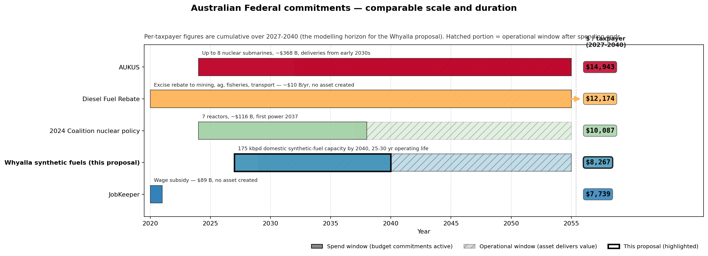

The chart above places the proposal alongside the four most
recently-precedented Australian Federal commitments. Spend windows
are solid; operational windows where the asset keeps delivering after
the budget commitment ends are hatched. The Whyalla programme (thick
black border) sits between JobKeeper (cheapest, no asset) and the
2024 Coalition nuclear policy (more expensive, similar timescale,
single-product).

---

## Why Whyalla / Port Bonython is the right site

No other location in Australia combines all five of the following.
Strategically, this is the *only* candidate site that pencils:

1. **Existing fuel-import terminal infrastructure.** Port Bonython
   already operates 81 ML of diesel storage with ~1 B L/yr throughput
   under Mitsubishi/Petro Diamond. The 2.4 km wharf takes capesize
   vessels to 110,000 DWT. The federal+state-funded Hydrogen Hub
   ($100 M, finalised October 2023) underwrites common-user upgrades.
   **Domestic synthetic fuel can flow into the same offtake network
   that currently handles imports** — no greenfield distribution
   build required.

2. **2,000 ha of industrial-zoned, deep-water-adjacent land** with
   Barngarla Determination engagement complete. Whyalla Industrial
   Estate adds a further 238 ha already optioned. Few sites in
   Australia can absorb a multi-GW industrial precinct without
   land-acquisition or planning frictions on the critical path.

3. **World-class renewables on the AEMO Draft 2026 ISP traces.**
   REZ S5 Northern SA capacity factors: ~25% solar PV (single-axis
   tracking), ~35-45% wind, with thermal-wind peaking afternoon/
   evening to complement solar — the single most valuable native
   electrolyser firming feature in the NEM. AEMO publishes a
   dedicated REZ S5 CST trace at ~51% capacity factor with bundled
   ~8h molten-salt storage dispatch.

4. **A live, six-tranche CO₂ supply curve** at A$80-500/t:
   - Whyalla Steelworks DRI off-gas (transition-window only,
     declining as the H₂ fraction in the shaft furnace rises 2029-40)
   - Nyrstar Port Pirie post-combustion (85 km)
   - Santos Moomba CCS pipeline-deliverable from 2032
   - Adbri Birkenhead cement (sea-freightable from Adelaide)
   - Direct Ocean Capture co-located with Northern Water at Mullaquana (from 2032)
   - DAC as backstop

   None of this requires technology that doesn't already exist
   commercially.

5. **Strategic adjacencies that don't exist elsewhere:**
   - **Northern Water desalination** (260 ML/day, FID FY2026/27,
     first water 2029) makes process water a sub-1% cost item.
   - **DRI-EAF waste heat** at the steelworks next door — ~200 GWh_th/yr
     of high-grade off-gas otherwise vented, available for adjacent
     hydrothermal-liquefaction biofuel ponds.
   - **Port Bonython storage and offtake** — already reading and
     blending Singapore product daily.
   - **Project EnergyConnect** (Stage 2 commissioning Q4 2026) puts
     5.3 GW of new transmission capacity through ElectraNet's
     Davenport hub.

---

## What the model actually builds

The model lets the optimiser choose between **e-fuel** and **biofuel**
pathways, all sharing common downstream infrastructure (hydrogen,
CO₂, heat, refinery, product buses):

```
                   Renewables (wind + solar + battery + CST)
                                  │
                          ┌───────┴───────┐
                          ▼               ▼
                    AC bus           Heat bus
                          │               │
                          ▼               │   ┌──── DRI waste heat (free, steelworks site)
                    Electrolyser           │
                          │               │
                          ▼               ▼
                       H₂ bus ◄─── electric heater / H₂ burner / CST
                          │
                  ┌───────┴────────────────┐
                  ▼                        ▼
          MeOH synthesis              HEFA / pyrolysis
              (CO₂ + 3H₂)            (halophyte / mallee / saltbush)
                  │                        │
                  ▼                        ▼
                MeOH ◄────────  biomass gasification
                  │                  (biogenic H₂ + CO₂)
                  ▼
                Refinery (FT + multi-feed shared hydrocracker)
                  │
        ┌─────────┼────────┬────────────────┐
        ▼         ▼        ▼                ▼
     Diesel    Kero     Naphtha           Wax
                                         (specialty)
```

**Three pathways compete on cost surface** to deliver each product:

- **e-fuels** — wind/solar/CST → electrolyser → H₂ → MeOH synth → FT-style refinery
- **HEFA** — Salicornia (halophyte) oil → hydrotreatment → kero+diesel
- **Pyrolysis / gasification** — coppice mallee + saltbush biomass

**HTL** (algae → biocrude) is built into the model topology but does not
get selected at current parameters (high capex per dry-tonne capacity);
it would activate if oil prices >A$4,000/t or HTL capex falls below
A$30k/(t_dry/yr). The pathway is geographically split into a
**steelworks-adjacent site** (free DRI waste heat, limited land) and
a **Port Bonython coastal site** (paid heat, more land) so the LP can
pick the better trade-off if either becomes economic.

**Biomass supply curves** (replacing earlier flat caps) — modelled like
the CO₂ tranche curve, with rising marginal cost as the LP climbs the
land-quality curve:

| Tranche | Area (ha) | Yield (t/ha/yr) | Delivered cost (AUD/t) |
|---------|----------:|----------------:|-----------------------:|
| Mallee tier 1 (Eyre Peninsula arable)        | 15,000  | 8.0 | 60   |
| Mallee tier 2 (mid-yield dryland)            | 40,000  | 6.0 | 110  |
| Mallee tier 3 (marginal pastoral)            | 150,000 | 4.0 | 180  |
| Saltbush tier 1 (coastal saline)             | 15,000  | 5.0 | 90   |
| Saltbush tier 2 (degraded pastoral)          | 50,000  | 3.0 | 140  |
| Halophyte oil tier 1 (NW outfall-adjacent)   | 5,000   | 1.2 | 1,200 (per t oil) |
| Halophyte oil tier 2 (inland saline)         | 25,000  | 0.8 | 1,800 (per t oil) |

Total biomass cap available: ~1.18 Mt_dry/yr lignocellulose + 26 kt/yr
halophyte oil — enough for ~400 kt/yr of biofuel, supplementing the
e-fuel volumes from 2029 onward.

---

## The three scenarios

Each scenario varies three independent levers — **electrolyser capex
trajectory**, **fossil-fuel price premium**, and **process WACC**:

| lever                  | policy_stated         | imo_binding             | foak_stranded             |
|------------------------|-----------------------|-------------------------|---------------------------|
| Electrolyser capex     | fast (1500→700 AUD/kW)| same                    | slow (1800→1200 AUD/kW)   |
| Fossil price premium   | none                  | +A$400/t diesel + A$350/t kero from 2032 | none |
| Process WACC           | 11%                   | 11%                     | 13%                       |

### `policy_stated` — central case
World follows IEA/IRENA stated policies. Fossil prices on UK DESNZ 2024
Scenario C with the Hormuz risk premium fading by 2030. Electrolyser
on the IEA NZE-adjacent fast-decline curve. **No regulatory price
floor on green fuels.**

### `imo_binding` — best case
Same physics + capex, but **from 2032 a real CO₂-intensity pricing or
blending mandate kicks in**:
- **+A$400/t diesel** — IMO Tier-1 carbon-intensity penalty on bunker
  fuel passing through to road diesel.
- **+A$350/t kero** — ReFuelEU-style SAF blending-mandate shadow price
  (or Australian equivalent).

Crucially this is a **revenue effect on fossil-equivalent product**,
not a green-fuel subsidy: the regulatory market lifts the floor under
what fossil sells for, so the green premium gap narrows. That's why
`imo_binding` is below JobKeeper — much of the gap is plugged by the
carbon market, not by the public budget.

### `foak_stranded` — pessimistic tail
**Slow electrolyser cost decline**, **no fossil-price premium** (carbon
mandates either don't materialise or are watered down), **WACC stuck
at 13%**. The "what if the world flinches" scenario; caps near the
nuclear-policy benchmark.

### Capital works schedule per scenario

The bottom panel below shows annual capex bars; the top panel shows a
Gantt-style commissioning schedule for each major asset.

**`policy_stated`**

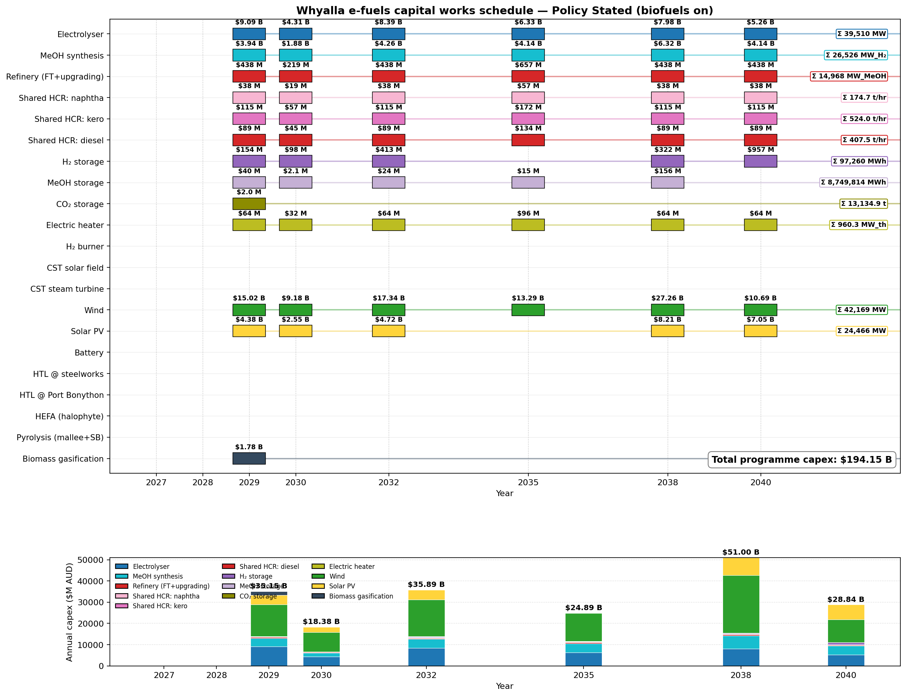

**`imo_binding`**

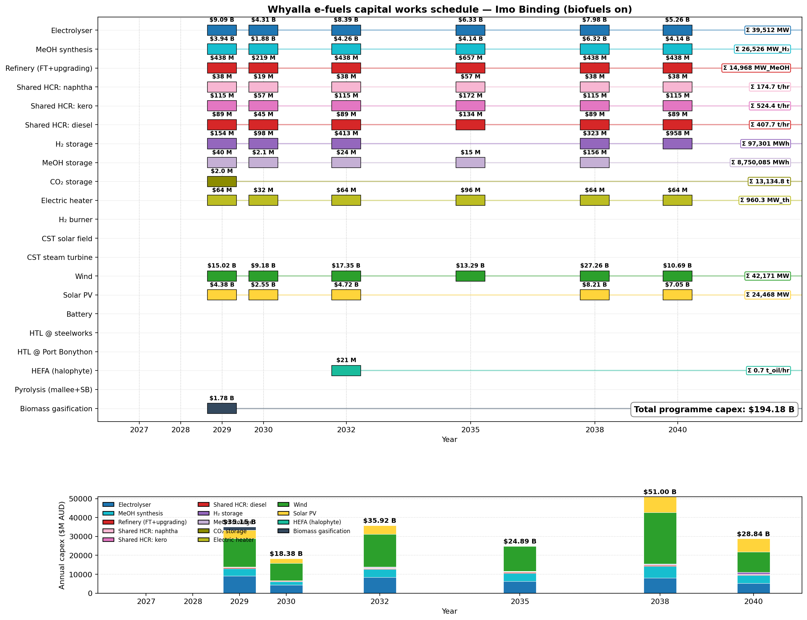

**`foak_stranded`**

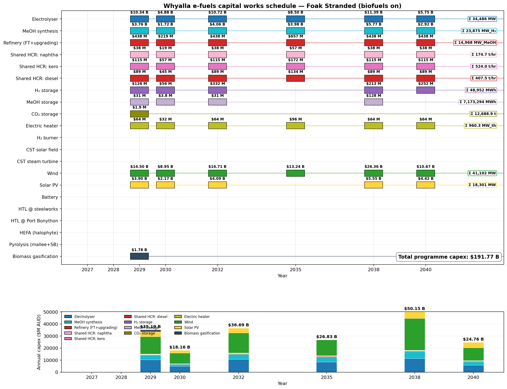

---

## Where the costs come from

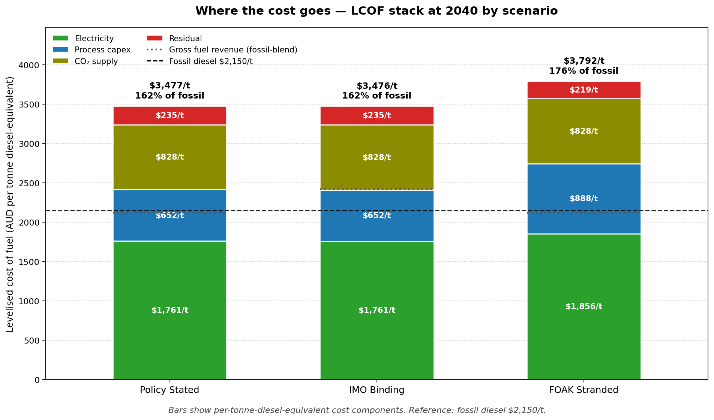

LCOF (levelised cost of fuel) at 2040 policy_stated = **A$3,465 per
tonne diesel-equivalent**, vs fossil diesel at A$2,150 — about a 60%
premium. The chart above decomposes this for all three scenarios.
Electricity dominates (~$1,760-1,860/t) — more than process capex
+ CO₂ + residual combined. The IMO premium scenario raises gross
revenue by $300/t (closing some of the gap) but doesn't materially
shift LCOF; the FOAK-stranded scenario adds ~$330/t to total cost
through higher electricity (~$95/t extra) and process capex (~$235/t
extra) on the same fuel slate.

Cost stack per tonne:

| Component                                   |  $/t  | % of stack |
|---------------------------------------------|------:|-----------:|
| Electricity (renewables × chain efficiency) | 1,800 | 52%        |
| Process capex (electrolyser, synth, refinery)|   850 | 25%        |
| CO₂ supply (six-tranche merit order)        |   500 | 14%        |
| Heat (CST + electric heater + H₂ burner)    |   170 |  5%        |
| Storage (H₂ + MeOH + CO₂ buffers)           |   145 |  4%        |

The dominant cost is **electricity** — driven by the chain efficiency
(~42% AC-to-fuel LHV: electrolyser × MeOH synth × refinery) and the
shadow price of renewables capex feeding through the AC bus balance.
Smaller wins:

- WACC dropping from 11% (FOAK) to 8% (NOAK by 2035) — saves
  ~A$300/t.
- CST + steam turbine (modelled but uneconomic at default A$4,300/kW_th
  Aurora-benchmark capex; would activate if CST capex falls below
  ~A$2,500/kW_th, which AEMO ISP cost-decline curves anticipate by 2035).

### Where the CO₂ comes from

Stacked dispatch by source over time. The LP picks the cheapest tranche
first — Whyalla Steelworks DRI off-gas (until the H₂ fraction rises
~2035) and Nyrstar Port Pirie at the bottom of the merit order; Santos
Moomba CCS and Adbri cement come on from 2032; Direct Ocean Capture at
the Northern Water site backs them up; Direct Air Capture takes any
shortfall. Blended price is plotted alongside.

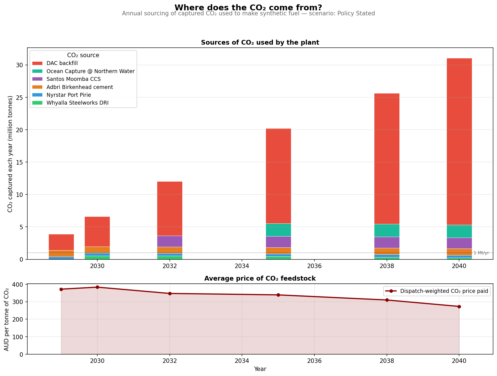

### How the network actually dispatches

Hourly dispatch in 2030, 2035, and 2040 — wind, solar, electrolyser
draw, MeOH synthesis steady-state behaviour, battery cycling, and
grid balancing. Shows that the LP exploits the H₂ + MeOH buffer chain
to keep MeOH synthesis near steady-state while the upstream renewables
are highly variable.

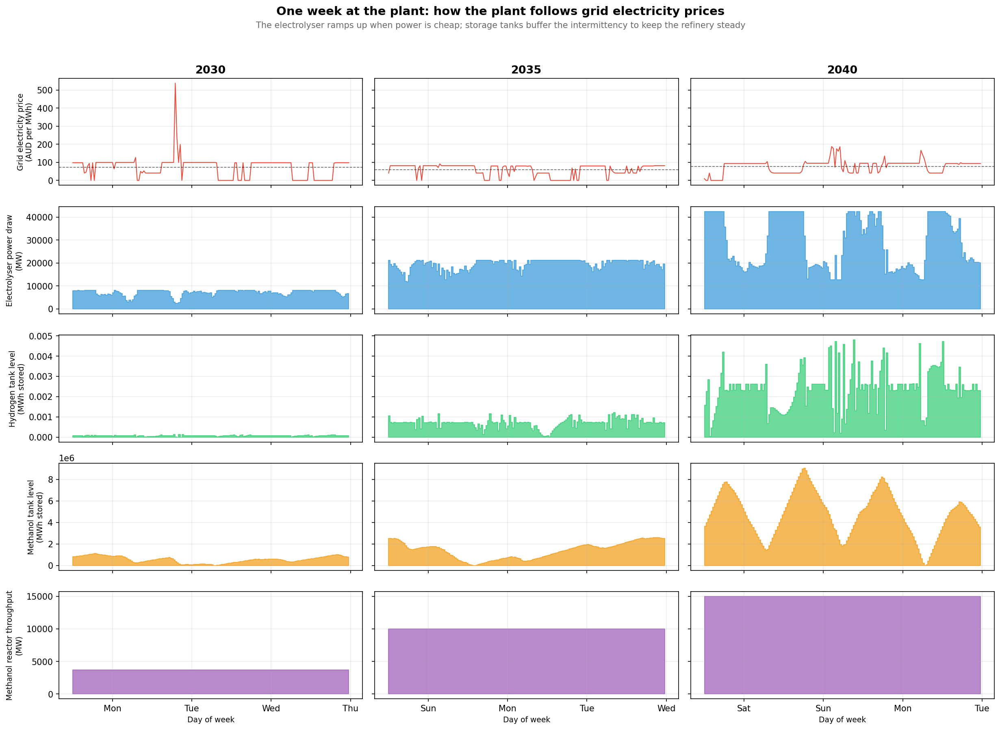

### Buffer partition (diagnostic)

Where the optimiser puts buffering between renewables and MeOH
synthesis at three different synthesis ramp-flexibility values.
Shows the H₂ → CO₂ → MeOH storage trade-off:

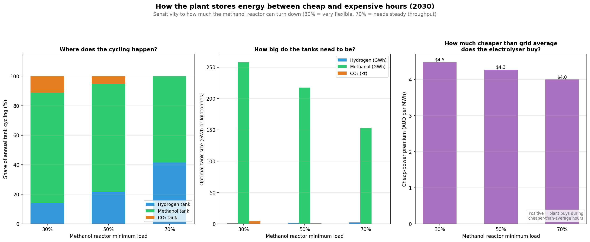

### Sensitivity heatmaps

Three 2D parameter sweeps showing where the cost surface is sensitive:

**Fossil prices vs LCOF.** What happens to the cost gap if oil prices
go higher / lower than DESNZ Scenario C predicts.

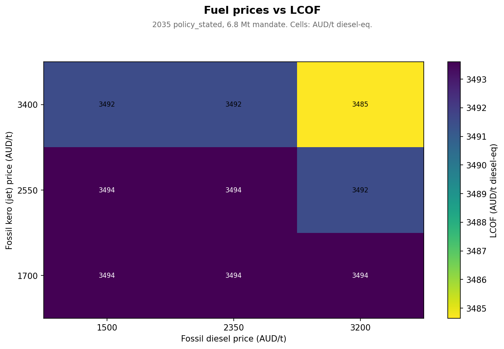

**Mandate × diesel price → biofuel volume.** How the optimiser shifts
between e-fuel and biofuel as the policy mandate scales.

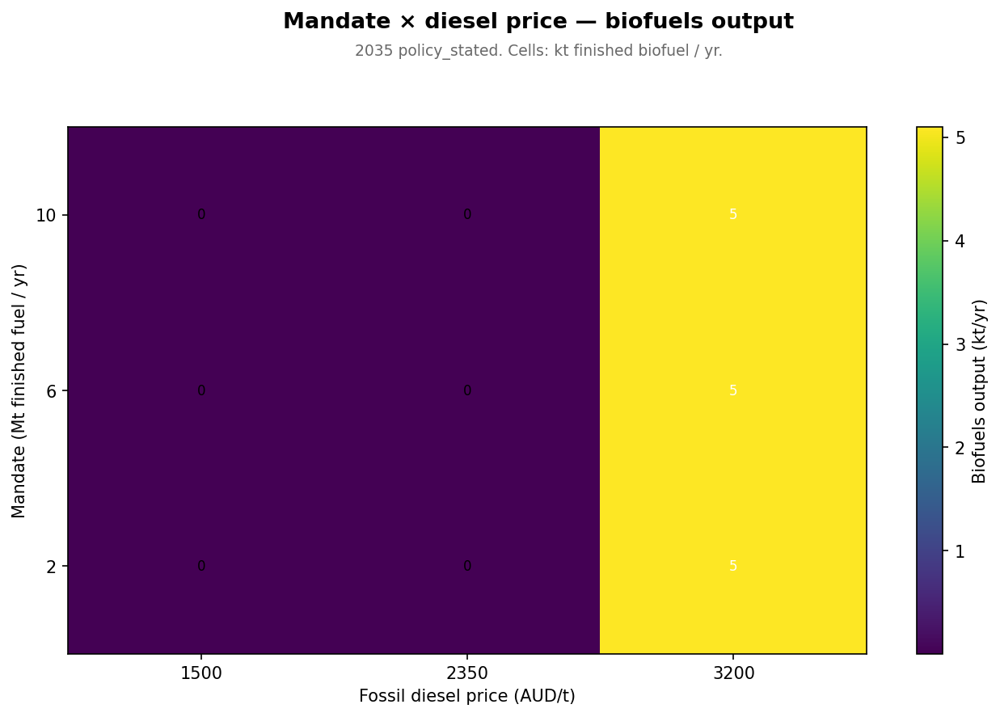

**DRI waste heat × mandate → LCOF.** How much it matters that the
algae-HTL pathway can tap free steelworks waste heat.

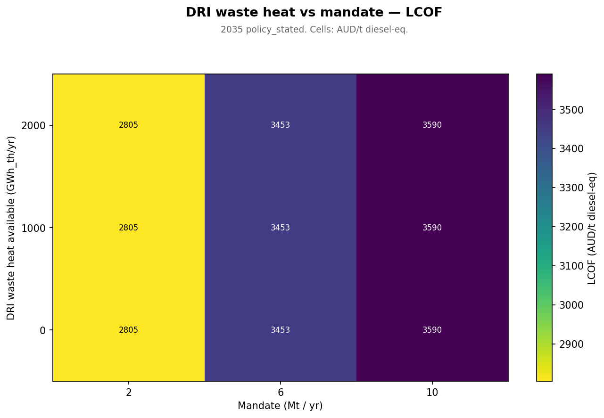

---

## Reproducing the analysis

Every figure in this README is reproducible from `trajectory.csv` plus
a handful of standalone solve scripts. The end-to-end regen — solve
plus all chart scripts — runs from a single shell entry point:

```bash
cd projects/efuels
./run.sh                    # full regen (~10-12 min)
./run.sh policy_stated      # single-scenario mode (~3-4 min)
```

The script runs four stages: (1) the LP trajectory solve, (2) the
trajectory-driven charts (six panel + capital works × 3 scenarios +
CO₂ supply curve), (3) the fuel-security framing charts (cost stack,
strategic substitution, programme timeline, electrification split),
and (4) the standalone solve diagnostics (dispatch, buffer partition,
biofuels sensitivity 3×3 sweep).

The model is built on **PyPSA** with **HiGHS** as the solver. Network
substrate uses the AEMO Draft 2026 ISP REZ S5 Northern SA traces for
wind, solar, and CST.

---

## What you can change

The most-toggled parameters and where they live:

| Knob | File | Default | Try |
|------|------|--------:|-----|
| Mandate path (Mt/yr) | `generate_trajectory.py:MANDATE_PATH_MT` | 1.0 → 10.2 | scale via `--mandate-scale 0.5` |
| WACC (process FOAK)  | `generate_trajectory.py:SCENARIOS` | 11% / 13% | 8% (NOAK) |
| Renewables WACC      | `generate_trajectory.py:RENEWABLES_WACC` | 7% | 5-8% |
| Electrolyser capex   | `generate_trajectory.py:CAPEX_PATHS` | 1500→700 (fast) | tune for own conviction |
| H₂ storage capex     | facility config | A$20k/MWh (tank) | A$5k/MWh (cavern, see Caveats) |
| CO₂ tranches         | `co2_supply.py:_TRANCHES` | 6 sources, A$80-500/t | tune per source |
| Biomass tranches     | `biofuels/biomass_supply.py` | 5 lignocellulose + 2 halophyte + 3 algae | scale areas/yields |
| Fossil price path    | `generate_trajectory.py:DIESEL_BASE` etc. | DESNZ 2024 Scenario C | apply own oil-price view |

---

## Caveats — read before quoting numbers

1. **The mandate is exogenous.** The model assumes a federal/state
   mandate or CfD lifts production from 0 in 2027 to 10.2 Mt/yr by
   2040. Without that, no commercial actor would build at this scale
   on a base-case fossil price.
2. **H₂ storage is vessels only (A$20k/MWh).** No SA salt-cavern
   geology is reachable from Whyalla — the closest candidate (Polda
   Basin, southern Eyre Peninsula) is ~250-300 km south, too far for
   cost-effective pipeline transport at this scale. The model anchors
   to compressed-vessel literature and the Hydrogen Jobs Plan
   reference site (250 MW PEM + 3,600 t = 120 GWh H₂ vessels at
   Cultana). The model's $20k/MWh sits at the lower end of vessel
   cost literature ($24-45k/MWh from ARENA / IEA), so this assumption
   is mildly optimistic; a $30k/MWh sensitivity run would lift LCOF
   ~$50-100/t.
3. **CST + steam turbine sit at zero capacity in the LP equilibrium.**
   At the Aurora-Project benchmark (A$4,300/kW_th bundled with 8h salt
   storage) it's marginally uneconomic vs grid-anchored renewables +
   electric heater. Cost-decline curves would activate it ~2035.
4. **The refinery slate is fixed** at hydrocracked-FT proportions
   (15% naphtha / 45% kero / 35% diesel / 5% wax). Real refineries
   can flex this within a band; we don't model that flex (would
   slightly improve LCOF when one product is dramatically more
   valuable than another).
5. **Process WACC is FOAK-conservative.** 11-13% reflects current
   first-of-a-kind risk. Successful 2030-FID cases would refinance
   at ~8% by 2035-37, saving ~A$300/t fuel — not modelled.
6. **CO₂ accounting is now stoichiometric.** An earlier modelling
   bug (parallel `refinery_{product}` Links) over-consumed CO₂ by
   3.35× and inflated LCOF by ~4×. The bug was found by mass-balance
   diagnostic and fixed (single multi-output `refinery` Link, matching
   the biofuel pathway pattern). All current numbers reflect the fix.
7. **No second-order effects modelled** — and these all run in the
   same direction (towards making the net case stronger):
   - **Strategic / fuel-security premium.** No notional dollar value
     applied for replacing 31% of imported liquid fuel with sovereign
     production. The Defence-of-Australia Strategic Review (2023)
     explicitly identifies fuel security as a Tier-1 capability gap.
   - **Stranded-refinery offset.** Both Lytton and Geelong sit on
     Federal life-support (FSSP) extended to 2030. Any cost
     comparison should be net of the cost of *not* maintaining
     domestic refining capacity.
   - **Diesel-rebate substitution.** Domestic synthetic fuel
     supplied to Diesel Fuel Rebate beneficiaries (mining, ag,
     fisheries, ADF) keeps the $10 B/yr rebate spending circulating
     in the Australian economy rather than leaving via fuel imports.
   - **Regional employment / industrial-policy multipliers.**
     A 10 Mt/yr precinct at Whyalla / Port Bonython supports an
     estimated 4,000-6,000 direct construction FTE peak and
     1,500-2,500 ongoing operations FTE — none of which are in the
     current model.
   - **Export option value.** RFNBO-certified e-kero into ReFuelEU
     Aviation premium markets (2032+) is worth A$1,200-2,500/t over
     fossil jet — the model does not allow excess production to be
     exported for that revenue.

   Every one of these would *reduce* the modelled per-taxpayer cost.

---

## Project structure

```
projects/efuels/
  generate_trajectory.py        — main solver (3 scenarios × 8 years)
  process_chain.py              — attach_efuels(): e-fuel topology
  efuels_physics.py             — H₂/CO₂/MeOH stoichiometry constants
  efuels_results.py             — extract_lcom_lcof(): cost decomposition
  co2_supply.py                 — 6-tranche CO₂ merit-order curve
  fossil_reference.py           — wholesale fuel price benchmarks
  heat_integration.py           — process heat bus, CST, electric heater, H₂ burner
  biofuels/                     — pathways colocated on shared buses
    biomass_supply.py             — tiered biomass supply curves
    pathway_htl.py                — algae HTL (steelworks + Port Bonython sites)
    pathway_hefa.py               — Salicornia HEFA
    pathway_biomass.py            — mallee+saltbush pyrolysis & gasification
  chart_*.py                    — six chart scripts (see above)
  run.sh                        — single-entry-point shell runner (solve + all charts)
  run.py                        — Python helper: default_config() + minimal solve
  trajectory.csv                — 24-row output table
  RESEARCH.md                   — original evidence dossier
```

---

## The fuel-security argument in one paragraph

Australia spent ~$89 B on JobKeeper and is committing ~$368 B to
AUKUS — both consequential national-interest decisions, neither
producing a tradeable industrial asset. The same per-taxpayer cost
as JobKeeper, or ~55% of AUKUS, would buy domestic production
capacity for ~31% of Australia's jet + diesel imports by 2040 —
fuel that flows from a precinct on Australian sovereign soil,
through Australian-owned ports, to the Australian fleet, ADF, and
diesel-rebate beneficiaries who underwrite the export economy. The
infrastructure keeps producing for 25-30 years after the policy
window ends. Under the most optimistic policy scenario the public
budget contribution falls below JobKeeper. Under the most pessimistic,
it caps at the proposed nuclear plan. The question is no longer
whether the technology works — it does, every unit operation has
commercial precedent — but whether Australia chooses to apply the
same risk appetite to fuel security that it has already applied to
submarines and pandemic wage support.

---

## What's next on the modelling side

Three calibrations would tighten the headline finding further:

1. **Refine the H₂ storage capex band** to the upper end of vessel
   literature (A$30k/MWh central, A$45k worst case). The current
   A$20k/MWh anchor sits at the optimistic end; a sensitivity run
   would lift LCOF $50-100/t and is worth doing for defensibility.
2. **Add the chemistry-synergy gaps still on the to-do list:**
   electrolyser O₂ → gasifier oxidant, biogenic CO₂ from
   HTL/HEFA/pyrolysis upgrading byproducts. Each ~3-5% LCOF.
3. **Cross-couple to the dri-eaf project** at the AC bus — joint
   optimisation might further reduce renewable overbuild because the
   steelworks load and the e-fuels load are partially complementary
   (steelworks consumes baseload, fuels can chase peaks).

#2 and #3 push the number toward `imo_binding` (i.e., closer to the
JobKeeper benchmark). #1 pushes it the other way. Net direction
depends on which dominates; both should be modelled before quoting
final figures.

---

Built with PyPSA + HiGHS. Wind, solar, and CST traces from AEMO Draft
2026 ISP REZ S5 Northern SA. Source-code comments document the
calibration decisions; supporting evidence and citations live in
`RESEARCH.md`.
